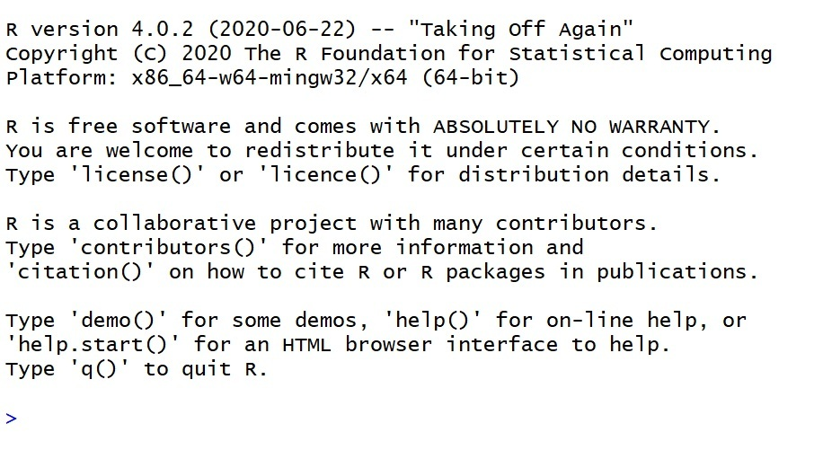

```{r setup, include=FALSE}
# knitr::opts_chunk$set(echo = TRUE)
```


# Programski jezik R

R je programski jezik in v širšem pomenu programska oprema, ki je namenjena predvsem delu s podatki, analizi in vizualizaciji. 

R je brezplačen, najdemo pa ga lahko na strani https://cran.r-project.org/. Predpostavili bomo, da smo si R že namestili in imamo dostop do najbolj osnovnega komuniciranja v programskem jeziku R -- preko t. i. konzole programskega jezika R:


<center>
{width=70%}
</center>

Znak `>` pomeni, da R čaka na naš ukaz. Programski jeziki so namreč le umetni jeziki, ki smo jih ustvarili za komuniciranje z računalniki, da jim lažje sporočimo, kaj bi radi, da naredijo za nas. Za razliko od naravnih jezikov, so programski jeziki veliko bolj preprosti, obenem pa so bolj zahtevni, saj je računalnik, če povemo po domače, precej neumen. Če mu ne bomo temeljito in brez napake sporočili, kaj želimo, nas ne bo razumel.

Za začetek ga poskusimo pozdraviti s "halo":

```{r error = T}
halo
```

Kot lahko vidimo, našega pozdrava ne razume in sporoči napako. Napak se ne bojimo -- računalnik je zelo potrpežljiv in nam ne bo zameril, tudi če se 100x zmotimo.

# R kot kalkulator

Sedaj pa je čas, da se naučimo nekaj besed v jeziku R. Začeli bomo s številkami in z osnovnimi računskimi operacijami. Jezik R, kot velika večina programskih jezikov, podpira delo s celimi in decimalnimi števili.

Najprej mu napišimo samo številko 4.5:

```{r}
4.5
```

R bo za nami ponovil 4.5, kar je naša prva uspešna komunikacija z njim! Obenem smo se naučili pomembne lastnosti jezika R -- če mu sporočimo številko ali, kot bomo kasneje videli, izraz ali spremenljivko, R izpiše vrednost.

R podpira osnovne matematične operacije seštevanja, odštevanja, množenja in deljenja, ki so predstavljene s standardnimi simboli `+`, `-`, `*` in `/`.

Poskusimo sešteti 1 + 1:

```{r}
1 + 1
```

Kot vidimo, R pravilno izračuna vrednost izraza 1 + 1 in, kot smo že rekli, izpiše vrednost. Na tem mestu bi omenili, da R ni občutljiv na presledke, zato bo enako razumel npr. te ukaze:

```{r}
1 + 1
1 +  1
 1+1
1+  1
```

Zaradi bolj pregledne programske kode pa se držimo, da med operacijami vnesemo presledek, pred in za ukazi pa ne vnašamo nepotrebnih presledkov.

Poskusimo še z nekaj izračuni:

```{r}
4.5 - 2.7
25 / 5
4 * 4
1643 / 3
5 / 3 + 2
5 / (3 + 2)
```

Pri zadnjih dveh izrazih velja omeniti, da R da prednost deljenju pred množenjem pred seštevanjem/odštevanjem. Če želimo najprej sešteti 3 + 2, potem mu moramo to sporočiti z oklepaji.

Že osnovni R podpira tudi druge uporabne matematične operacije, kot so potenciranje (`^`, ima prednost pred deljenjem), logaritmiranje (`log`, `log2`, `log10`, ...) in trigonometrične funkcije (`sin`, `cos`, ...). Nekaj primerov:

```{r}
3^2
sqrt(4)
log10(100)
sin(0)
cos(0)
log2(2^10)
((sin(3) + cos(4))^2 + 2.5) / 100
```

# Spremenljivke

Kalkulatorji nam omogočajo, da si vrednost izračuna tudi shranimo za poznejšo uporabo, kar pogosto poenostavi izračune, če se del izračuna večkrat ponovi. Koncept shranjevanja vrednosti je sestaven del večine programskih jezikov, entitete, ki hranijo vrednosti, pa imenujemo spremenljivke.

Vsaka spremenljivka ima unikatno ime, za katerim se skriva njena vrednost. Kot smo že omenili, če spremenljivko pokličemo po imenu, R samo izpiše njeno vrednost. To lahko poskusimo s `pi`, ki je spremenljivka, ki je že vgrajena v R, in hrani približek te znane matematične konstante. Seveda lahko ta `pi` uporabimo tudi v izrazih:

```{r}
pi
pi^2
sin(pi)
cos(pi)
```

Naslednji korak pa je, da se naučimo, kako ustvariti spremenljivko. Najlažji način je, da ji izberemo ime in izbranem imenu priredimo vrednost s pomočjo operatorja za določanje vrednosti `<-`. Pri izbiri imen spremenljivk se zaenkrat omejimo na črke, med katerimi je lahko tudi podčrtaj. Npr. `x`, `y`, `z`, `vmesni_rezultat`, ipd...

Poglejmo si, kako spremenljivka x ne obstaja, ko pa ji dodelimo vrednost, jo R izpiše:

```{r error = T}
x
x <- 5
x
```

Vrednost spremenljivke lahko določimo tudi z izrazom, kar nam potem omogoča, da vrednost izraza uporabimo v različnih nadaljnjih izračunih:

```{r error = T}
x <- 5
y <- 2
z <- (x + y)^2
log(z)
z^2
```

Imena vseh naših spremenljivk, ki trenutno obstajajo, lahko izpišemo z ukazom `ls()`:

```{r error = T}
ls()
```

Če želimo spremenljivko odstraniti, kar bomo sicer le redko delali, lahko uporabimo ukaz `rm(<ime spremenljivke>)`:

```{r error = T}
rm(x)
ls()
```

R ukaze izvaja v vrstnem redu, kot jih dobi. Če se vrednost spremenljivke na nekem mestu spremeni, bodo nadaljnji ukazi to spremembo upoštevali:

```{r error = T}
x <- 5
x^2
x <- 4
x^2
```

Ko R zapremo, se izgubijo vse informacije o spremenljivkah. Če bi jih želeli uporabiti tudi kasneje, jih lahko shranimo z ukazom `save.image()` in naložimo z ukazom `load()`. Pokažimo to 

```{r eval = T}
ls()
save.image(file = 'spremenljivke.RData')
rm(list = ls(all = T)) # pobrišemo vse spremenljivke
ls()
load('spremenljivke.RData')
ls()
```

# Vektorji

V programskih jezikih spremenljivke pogosto organiziramo na način, ki olajša delo z njimi. Takim načinom organizacije pravimo tudi podatkovne strukture. Prva in najpomembnejša struktura, ki jo bomo spoznali, je t.i. vektor -- seznam spremenljivk istega tipa.

Vektor lahko naredimo na več načinov. Najprej z združevanjem elementov s funkcijo za združevanje `c()`:

```{r}
c(1, 2, 3)
c(x, y, z)
x1 <- c(2, 5, 3)
x1
```

Zadnji primer pokaže, da lahko spremenljivka kaže tudi na podatkovno strukturo in ne samo na eno samo številko.

Če želimo narediti vektor določene dolžine z določenimi elementi, potem lahko uporabimo funkcijo `rep()`, ki ima dva argumenta -- vrednost in dolžina:


```{r}
rep(1, 5)
rep(x, 10)
```

Do posameznih elementov seznama dostopamo z indeksiranjem z uporabo `[]`. Posamezen element vektorja števil je tudi spremenljivka, zato lahko ji spremenimo vrednost.

```{r}
x1 <- c(25, 3, -1, -20)
x1
x1[1]
x1[2]
x1[3]
x1[3] <- 2
x1[3]
```

Vektor je najpomembnejša podatkovna struktura v R. Velika prednost Rja je, da lahko operacije izvajamo tudi nad vektorji, ne samo nad posameznimi številkami. Operacija se izvede nad vsakim elementom. 

```{r}
x <- c(1, 2, 2, 5)
x^2
x - 5
-x
x / 5
```

Računamo lahko tudi z vektorji. Zaenkrat predpostavimo, da to lahko počnemo samo z vektorjema enake dolžine:

```{r}
x <- c(1, 2, 2, 5)
y <- c(-1, -2, -2, -5)
x + y
x * y
```


Prav tako R vsebuje mnogo uporabnih funkcij nad vektorji, začenši z vsoto, povprečjem, mediano, minimumom, maksimumom in standardnim odklonom:

```{r}
x <- c(1, 2, 2, 5)
sum(x)
mean(x)
median(x)
min(x)
max(x)
sd(x)
```

V R lahko dostopamo tudi do več elementov hkrati. To lahko storimo na zelo enostaven način -- namesto ene same številke indeksiramo z vektorjem številk:

```{r}
x <- c(1, 2, 2, 5)
x[c(1, 3)]
x[1:3]
```

V drugem primeru smo uporabili še eno uporabno "besedo" iz programskega jezika R. Z `a:b` dobimo vektor vseh števil med a in b.

```{r}
1:5
-4:4
4:-2
```

# Domača naloga

1. Izrek Pitagore pravi, da v pravokotnem trikotniku velja $a^2 + b^2 = c^2$, kjer sta $a$ in $b$ dolžini katet, $c$ pa dolžina hipotenuze. Napišite kratek program, kjer na začetku dodelimo vrednosti dolžinama $a$ in $b$, nato pa izračunamo dolžino hipotenuze $c = \sqrt{a^2 + b^2}$ in jo izpišemo. Kaj se izpiše, če $a$ ali $b$ namesto ene številke priredimo vektor številk in izračun ponovimo?

Primer (izračun je izpuščen):

```{r}
a <- 3
b <- 4
```


```{r echo = FALSE}
sqrt(a^2 + b^2)
```

2. Podan imamo vektor cen izdelkov in vektor enake dolžine, v katerem so zapisane stopnje DDV za izdelke v prvem vektorju. Primer:

```{r}
cena <- c(153, 4.5, 12, 53.5, 8.7) # cena v €
DDV  <- c(22, 9.5, 22, 22, 9.5) # DDV v %
```

S čim manj operacijami izračunajte skupno ceno brez in skupno ceno z DDV.

Rešitev za primer zgoraj:

```{r echo = FALSE}
sum(cena)
sum(cena * (1 + DDV / 100))
```

3. **Težja naloga** V vektorju `temperatura_max` so zapisane napovedi najvišje dnevne temperature za naslednjih 14 dni, podobno v vektorju `temperatura_min` pa najnižje.

```{r}
temperatura_max <- c(21.1, 19.4, 18.0, 17.8, NA, 16.2, 16.8, 
                     18.9, 17.6, 19.2, NA, 21.1, 19.9, 21.7) # najvišja dnevna temperatura
temperatura_min <- c(10.2, 6.0, 10.3, 11.0, 9.1, 7.8, NA,
                     9.0, 9.2, 8.6, 8.1, 9.2, 8.3, 7.6) # najnižja dnevna temperatura
```
Kot opazimo, v prvem vektorju manjkata vrednosti na 5. in 11. mestu, v drugem pa le ena na 7.

a. Zamenjaj manjkajoče vrednosti v vektorjih s povprečno vrednostjo istega vektorja. (*Hint* z ukazom `?mean` v konzoli poglej čemu služi parameter na.rm fukcije mean.)

Rešitev:
```{r echo = FALSE}
temperatura_max[c(5,11)] <- mean(temperatura_max, na.rm = TRUE)
print(temperatura_max)

temperatura_min[7] <- mean(temperatura_min, na.rm = TRUE)
print(temperatura_min)
```

b. Izračunaj minimalen in maksimalen dnevni razpon temperature v naslednjih 14 dneh.
```{r echo = FALSE}
razpon <- temperatura_max - temperatura_min
print("Maksimalen: ")
print(max(razpon))
print("Minimalen: ")
print(min(razpon))
```