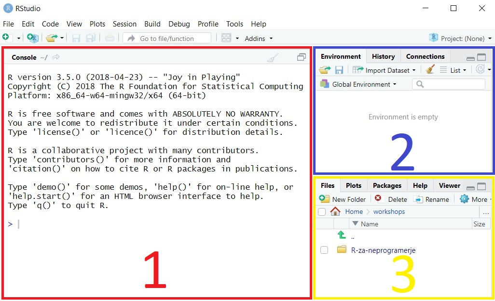
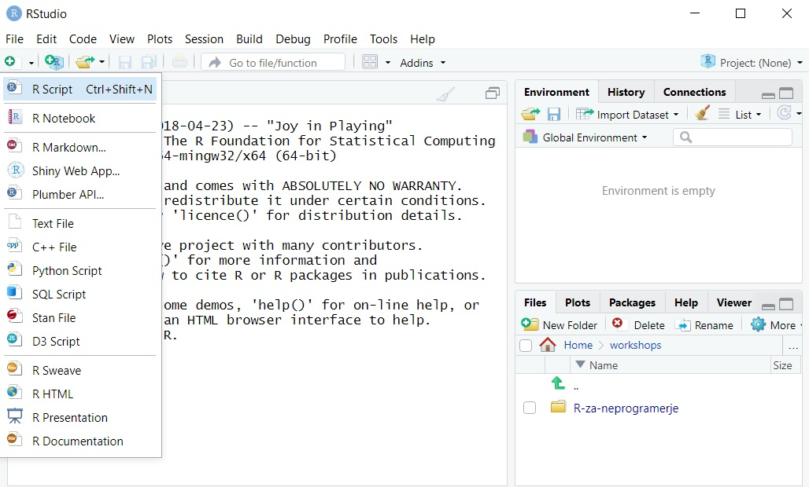
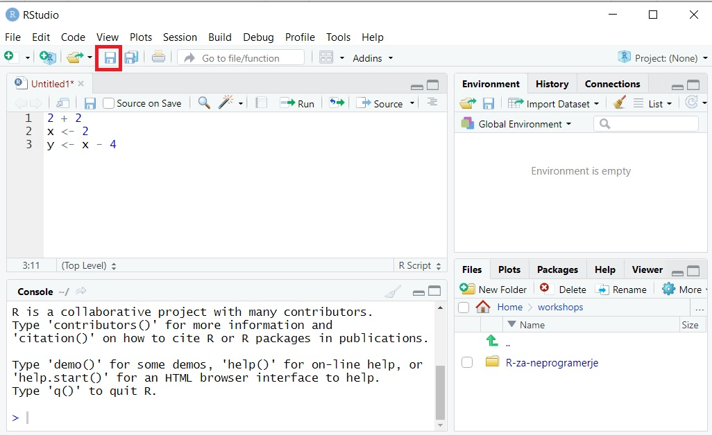
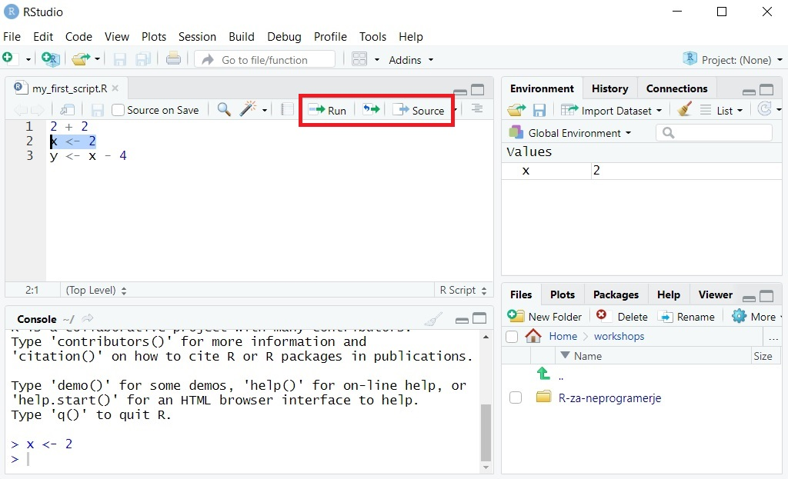
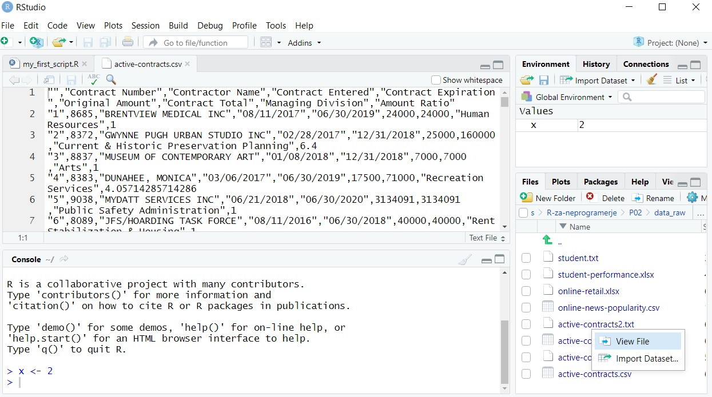

# RStudio
RStudio je integrirano razvojno okolje (integrated development environment -- IDE) za razvoj programov in aplikacij s programskim jezikom R. Bolj splošno, RStudio vsebuje vse potrebno za pisanje programov v R. Predstavlja nadgradnjo preproste konzole R, predvsem pa uporabniku olajša delo. V tem delu bomo predstavili pomembnejše funkcije RStudia.

Ko odpremo RStudio opazimo da je razdeljen na tri okna:


<center>
{width=100%}
</center>

Poglejmo si vsakega izmed oken nekoliko bolj podrobno.


## 1: Konzola
Konzolo v rdečem okencu smo že spoznali na prvem predavanju. Tukaj se bodo izvajali vsi naši ukazi. Ta del je ekvivalenten konzoli, ki jo premore osnovna različica uporabniškega vmesnika, ki ga dobimo z osnovno namestitvijo programskega jezika R.


## 2: Okolje in zgodovina
V modrem okencu sta za nas pomembna zavihka **Environment** (okolje) in **History** (zgodovina). Prvi prikazuje spremenljivke, ki jih imamo v trenutni seji R. Spoznali smo že ukaz `ls()`, ki vrne imena vseh spremenljivk, ki so trenutno shranjene. S pregledom okolja tega klica ne potrebujemo, saj imamo ta seznam ves čas na voljo. Poleg tega pa nam okolje vrne še nekaj podrobnosti o vsaki spremenljivki. Zaenkrat opazimo, da je naše okolje še prazno, saj še nismo definirali nobene spremenljivke. Zgodovina nam hrani vse klice v konzoli, ki smo jih izvedli tekom trenutne seje R.


## 3: Datoteke, grafi, paketi in pomoč
V rumeno označenem okencu so za nas pomembni zavihki **Files**, **Plots**, **Packages** in **Help**.

1) **Files**. Tukaj lahko brskamo po računalniku, odpiramo datoteke v RStudiu in ustvarjamo nove mape.
2) **Plots**. Tukaj se nam bodo prikazovali grafi, ki jih bomo ustvarili. Vizualizacijo bomo spoznali v prihodnjih predavanjih.
3) **Packages**. Zavihek namenjen namestitvi in nalaganju paketov (knjižnic). Te bomo spoznali kasneje v tem poglavju.
4) **Help**. Vsaka funkcija v R ima t.i. help file, kjer so navedene podrobnosti funkcije, katere argumente lahko vnesemo in primer uporabe ali dva. Uporabo tega bomo spoznali v prihodnjih predavanjih.


# Delovni direktorij (working directory)
Preden začnemo z delom v R je dobro določiti mapo, ki bo predstavljala naš delovni direktorij. To nam bo omogočilo lažji dostop do datotek v tej mapi (na primer podatkov) in lažje shranjevanje rezultatov v to mapo. Da določimo delovni direktorij uporabimo ukaz `setwd(<pot-do-mape>)`. Na primer, recimo da želimo delovni direktorij v mapi *C:\\Users\\Gregor\\Documents\\workshops\\R-za-neprogramerje\\P02*. Potem uporabimo

```{r, error = TRUE}
setwd("C:\Users\Gregor\Documents\workshops\R-za-neprogramerje\P02")
```

Opazimo, da je R vrnil napako. Ampak, kot smo že rekli, napak se ne bojimo. Poizkusimo ugotoviti, kaj nam R želi s svojim sporočilom povedati. V kolikor nam sporočilo ni razumljivo je najbolje da ga kar pogooglamo. V večini primerov je že nekdo naletel na isto težavo in je postavil vprašanje na enem izmed za to namenjenih portalov (na primer https://stackoverflow.com/). V zgornjem primeru bi hitro ugotovili da je problem v uporabi leve poševnice (backslash). R ima backslash namreč rezerviran za posebne funkcije, tako da ga je treba zamenjati ali z dvojno levo poševnico

```{r}
setwd("C:\\Users\\Gregor\\Documents\\workshops\\R-za-neprogramerje\\P02")
```

ali s poševnico

```{r}
setwd("C:/Users/Gregor/Documents/workshops/R-za-neprogramerje/P02")
```

V kolikor kdaj nismo prepričani, katera mapa predstavlja naše trenutno delovno okolje, uporabimo ukaz `getwd()`

```{r}
getwd()
```


# Skripte
Skripte so glavni sestavni deli programov v R. So preproste datoteke, v katere zaporedno pišemo ukaze, ki jih nato pošiljamo R konzoli. Prednost uporabe skript v primerjavi s pisanjem ukazov direktno v konzolo je v tem, da si ukaze v skripti lahko shranimo. Naredimo sedaj našo prvo skripto. Za to imamo v RStudio na voljo ikono, ki se nahaja pod zavihkom **File** v levem zgornjem kotu.

<center>
{width=100%}
</center>

Ko naredimo novo skripto, se nam odpre novo okno v RStudiu, poleg treh oken, ki smo jih že spoznali. To je okno, ki je v veliki meri namenjeno skriptam. Zapišimo nekaj že znanih ukazov v to novo skripto in jo shranimo. Za shranjevanje skripte lahko uporabimo ikono diskete označeno na spodnji sliki, ali ukaz **Ctrl + S**.

<center>
{width=100%}
</center>

Kako sedaj poženemo te ukaze? Če želimo pognati samo del ukazov v skripti, to naredimo tako da z miško označimo samo tiste ukaze in kliknemo na ukaz **Run** (označeno z rdečo na spodnji sliki) ali uporabimo bljižnico na tipkovnici **Ctrl + Enter**. V kolikor želimo pognati celotno skripto lahko uporabimo ukaz **Source**. Poženimo sedaj ukaz `x <- 2`.

<center>
{width=100%}
</center>

Kaj se je zgodilo? Ukaz **Run** je označen del pognal v konzoli, enako kot če bi mi zapisali ta ukaz v konzolo sami. Opazimo tudi, da sedaj naše okolje več ni prazno -- sedaj se v njem nahaja spremenljivka $x$, ki vsebuje vrednost 2.

V začetku je uporaba ene skripte popolnoma zadovoljiva in lahko celoten program oziroma postopek analize shranimo v samo eno skripto. Ko naše analize in manipualcije postajajo bolj kompleksne, se običajno poslužujemo večih skript.


# Paketi
Osnovna različica R nam nudi veliko možnosti za delo s podatki. Vendar včasih potrebujemo kakšne specifične funkcije, ki jih ne najdemo v osnovni različici. Prav tako je osnova različica lahko relativno toga in bi želeli uporabniku prijaznejše funkcije. Za to so na voljo t.i. paketi ali knjižnice. Za R obstajajo številni paketi, saj je R odprtokodni programski jezik in lahko vsak uporabnik kreira svoj paket in ga naloži na internet. Nekaj njihovih funkcionalnosti vključuje:

1) Lepše vizualizacije.
2) Lažje čiščenje in urejanje podatkov.
3) Metode strojnega učenja.
4) Povezave med R in drugimi orodji (kot na primer Microsoft Excel).
5) Avtomatsko generiranje poročil.

V sklopu te delavnice bomo spoznali paketa **openxlsx** za delo z Excelovimi datotekami in **ggplot2** za vizualizacijo.

Pakete lahko namestimo s funkcijo `install.packages("<ime paketa>")` ali s klikom na zavihek **Packages** in nato **install**, kjer nato poiščemo ustrezen paket.


# Branje podatkov
V kolikor želimo R uporabljati za delo s podatki, se moramo najprej naučiti, kako prenesti podatke iz drugih virov v R. V tem poglavju bomo spoznali branje podatkov iz tekstovnih in excelovih datotek.

## Dva pogosta tipa podatkovnih datotek
Podatkovne datoteke lahko srečamo v veliko različnih formatih. Dva najbolj pogosta sta:

1) Excelova datoteka. Večina podjetij za velik del dela s podatki uporablja Microsoft Excel, tako da so Excelove datoteke pogost vir podatkov.

2) Tekstovna datoteka (končnice txt, csv). Podatki so zapisani v tekstovno datoteko. Da ločimo posamezne elemente med seboj, se običajno uporabi podpičje, vejica, ali tabulator (tab).


## Branje iz tekstovnih datotek
Za branje podatkov iz standardnih txt ali csv zapisov imamo v R na voljo 4 funkcije:

1) `read.csv()`. Kadar so elementi ločeni z vejico in imamo decimalno piko.
2) `read.csv2()`. Kadar so elementi ločeni s podpičjem in imamo decimalno vejico.
3) `read.delim()`. Kadar so elementi ločeni s tabulatorjem in imamo decimalno piko.
4) `read.delim2()`. Kadar so elementi ločeni s tabulatorjem in imamo decimalno vejico.

Kadar so elementi ločeni z vejico ali podpičjem imamo običajno opravka s csv (comma separated value) končnico, čeprav bi lahko te podatke shranili tudi v txt formatu. Kadar imamo elemente ločene kako drugače se običajno uporabi txt končnica.

Naložimo sedaj podatke iz tekstovne datoteke *active-contracts.csv*, ki je na voljo v mapi *data\_raw*, v našo trenutno sejo R. Podatki predstavljajo tekoče pogodbe mesta City of West Hollywood. Originalni podatki so na voljo na https://data.world/weho/atdr-sk64. Zaenkrat ne bomo posvečali preveč pozornosti samim podatkom, naš cilj je samo da se jih naučimo naložiti in shraniti.

Preden se lotimo pisanja programske kode, moramo preveriti, kako so podatki shranjeni. Tekstovno datoteko lahko odpremo kar z RStudiem. V zavihku **Files** se pomakenemo do vsebine mape *data\_raw*, kliknemo na željeno datoteko in izberemo **View file**.

<center>
{width=100%}
</center>


Opazimo, da imamo decimalno piko in elemente ločene z vejico, torej bomo uporabili `read.csv()`.

```{r}
act_contracts <- read.csv("./data_raw/active-contracts.csv")
```

Potrebno je omeniti, da pika v zgornji poti predstavlja trenutni direktorij. Celotno besedilo znotraj narekovajev torej kaže na datoteko, relativno glede na naš delovni direktorij. R avtomatsko shrani prebrane podatke v **podatkovno razpredelnico** oziroma `data.frame`. Ta objekt si lahko predstavljamo kot Excelovo tabelo, ki jo R hrani v obliki spremenljivke, v našem primeru `act_contracts`. Za ogled celotne razpredelnice lahko uporabimo funkcijo `View()`.

```{r, eval = FALSE}
View(act_contracts)
```

Enako lahko dosežemo s klikom na to spremenljivko v zavihku **Environment**. Velikokrat želimo videti samo strukturo razpredelnice. Za ta namen lahko pogledamo samo prvih 6 vrednosti v razpredelnici s klicem `head()`.

```{r}
head(act_contracts)
```

Ko imamo razpredelnico shranjeno kot spremenljivko v R, lahko nad njo izvajamo operacije in manipulacije, ki jih bomo spoznali v prihodnjih predavanjih. Dobra stran R-ja je v tem, da to razpredelnico spreminjamo lokalno znotraj R in originalna datoteka, iz katere smo prebrali podatke, ostane nespremenjena.

Za vajo naložimo še podatke *active-contracts.txt*, *active-contracts2.csv* in *active-contracts2.txt*. Pri vseh datotekah gre za iste podatke shranjene v različnih formatih. Opazimo da ima datoteka *active-contracts2.csv* elemente ločene s tabulatorjem in decimalno piko, uporabimo torej

```{r}
act_contracts <- read.delim("./data_raw/active-contracts.txt")
```

Pri *active-contracts.txt* imamo elemente ločene s podpičjem in decimalno vejico, uporabimo torej

```{r}
act_contracts <- read.csv2("./data_raw/active-contracts2.csv")
```

V *active-contracts2.txt* opazimo nestandarden separator in sicer dvopičje. Kako se lotiti tega? Lahko pozkusimo z eno od nam že znanih funkcij, na primer `read.csv2()`. 

```{r}
act_contracts <- read.csv("./data_raw/active-contracts2.txt")
```

R ni vrnil napake, torej je morda vse v redu. Vsekakor moramo zadevo preveriti. Prvi znak, da je šlo nekaj narobe je, če pogledamo v zavihek **Environment**. Opazimo da je spremenljivka *act_contracts* razpredelnica s samo enim stolpcem. Zaradi izbire napačnega separatorja R ni znal razdeliti stolpcev, zato je v edini stolpec zapisal kar celo vrstico kot besedilo. Potrebujemo torej neko drugo funkcijo.

Funkcije, ki smo jih spoznali do sedaj so vse specifične različice bolj splošne funkcije `read.table()`, kjer so določeni argumenti (separator, decimalni simbol) vneseni že vnaprej. V kolikor se srečamo s podatki, ki ne ustrezajo nobeni izmed 4 standardnih formatov, se moramo poslužiti te bolj splošne funkcije in vnesti nekoliko več truda v izbiro njenih argumentov. Za nas so trenutno pomembni trije:

1) `sep`. Določa separator.
2) `dec`. Določa decimalni simbol.
3) `header`. Ali imajo podatki podana imena stolpcev. Vnesemo lahko vrednosti `TRUE` če je to res in `FALSE` če ni.

Poizkusimo sedaj prebrati podatke s to funkcijo in ustrezno nastavitvijo parametrov.

```{r}
act_contracts <- read.table("./data_raw/active-contracts2.txt", sep = ":", dec = ",", 
                            header = TRUE)
head(act_contracts)
```

Super, zadeva deluje! Sedaj znamo naložiti podatke iz tekstovne datoteke v R! Pri uporabi funkcije `read.table` je potrebno biti pozoren na narekovaje. Velikokrat z narekovaji označimo besedilne spremenljivke. Funkcije `read.csv`, `read.csv2`, `read.delim` in `read.delim2` vse uporabljajo kot narekovaj znak `"`. Funkcija `read.table` pa poleg tega znaka uporablja tudi znak `'`. V kolikor na to nismo pozorni, lahko pride do težav, če imamo na primer podatke, kjer se `'` pojavi v besedi. Za primer poizkusimo prebrati *active-contracts.txt* s funkcijo `read.table`.

```{r}
act_contracts <- read.table("./data_raw/active-contracts.txt", sep = "\t", dec = ".", 
                            header = TRUE)
head(act_contracts)
```

S pogledom v **Environment** opazimo, da ta tabela nima istega števila vrstic kot tabele, ki smo jih prebrali prej. Težava je v tem, da je R razumel znak `'`, ki se je pojavil v enem od stolpcev, kot znak za besedilo. Zaradi tega je vse med tem znakom in med naslednjim takšnim znakom prebral v eno celico, kot dolgo besedilo. Da se temu izognemo moramo dodati parameter `quote = "\""`, ki bo dopuščal samo `"` kot narekovaj.

```{r}
act_contracts <- read.table("./data_raw/active-contracts.txt", sep = "\t", dec = ".", 
                            header = TRUE, quote = "\"")
head(act_contracts)
```

Potrebno je omeniti, da R hrani spremenljivke v različnih formatih, odvisno od njihovih vrednosti (na primer številke imajo drugačen tip od besed). Tipe bomo podrobneje spoznali v prihodnjih predavanjih. Poseben tip spremenljivk so **faktorji** in kadar beremo podatke iz tekstovnih datotek R privzeto določi besednim spremenljivkam tip faktor. Tega trenutno ne želimo, zato bomo morali vnesti dodaten parameter v funkcijo `read.csv`, in sicer `stringsAsfactors = FALSE`. Več o faktorjih bomo izvedeli čez nekaj predavanj. Funkcijam, ki smo jih uporabili v tem poglavju torej dodamo ta argument, na primer:

```{r, eval = FALSE}
act_contracts <- read.csv("./data_raw/active-contracts.csv", stringsAsFactors = FALSE)
```


## Branje iz excelovih datotek
V tem poglavju se bomo lotili branja podatkov iz Excelovih datotek. Za to potrebujemo paket **openxlsx**. Najprej moramo namestiti ta paket.

```{r, eval = FALSE}
install.packages("openxlsx")
```

Ter ga naložiti v našo trenutno sejo R.

```{r}
library("openxlsx")
```


Za branje podatkov iz Exelovih datotek uporabimo funckijo `read.xlsx()`. Funkcija zahteva vsaj dva argumenta:

1) `file`. Pot do datoteke, iz katere želimo prebrati podatke.
2) `sheet`. Indeks ali ime Excelovega lista, ki ga želimo odpreti. Običajno se v eni excelovi datoteki nahaja več listov. S tem argumentom R-ju sporočimo, kateri list naj naloži.


Poglejmo si sedaj kako naložiti podatke iz excelove datoteke. V mapi *data\_raw* imamo datoteko *student-performance.xlsx*, kjer so shranjeni podatki o uspešnosti dijakov pri testih iz matematike in portugalščine. V datoteki *student.txt* se nahajajo razlage vrednosti posameznih spremenljivk. Podatki so bili uporabljeni v raziskavi @Cortez2008 in so na voljo na https://archive.ics.uci.edu/ml/datasets/Student+Performance. Preberimo podatke testov iz matematike in portugalščine in shranimo vsake v svojo spremenljivko.

```{r}
student_math <- read.xlsx("./data_raw/student-performance.xlsx", 
                          sheet = "Math scores")
student_port <- read.xlsx("./data_raw/student-performance.xlsx", 
                          sheet = "Portuguese scores")
```

Enako dosežemo z

```{r}
student_math <- read.xlsx("./data_raw/student-performance.xlsx", sheet = 2)
student_port <- read.xlsx("./data_raw/student-performance.xlsx", sheet = 1)
head(student_math)
head(student_port)
```


# Shranjevanje podatkov
Ena glavnih prednosti R-ja je, da lahko originalne podatke shranimo in tam ostanejo nespremenjeni. Ko jih naložimo v R, se znotraj R ustvari kopija originalnih podatkov. Nato so vse manipulacije nad njimi shranjene v R skripti. Potem lahko spremenjene podatke shranimo kot novo datoteko. Dokaj običajen pojav pri delu s podatki je, da čiščenje in urejanje podatkov vzame več časa, kot ga dejanska analiza. Zato je ta korak pri delu s podatki zelo pomemben.

Dodatna prednost uporabe R skript je v tem, da lahko podatke, ki se spreminjajo periodično, uredimo z isto skripto. Na primer, če bi morali vsak mesec prenesti podatke iz podatkovne baze in jih nato ročno očistiti, bi nam to vzelo precej časa. Z uporabo R lahko proces čiščenja vsaj do neke mere avtomatiziramo in prihranimo dragocen čas za preostale naloge.

V prejšnjem poglavju smo se naučili prebrati podatke iz različnih virov. V tem poglavju bomo pogledali kako podatke shraniti.

## Shranjevanje v tekstovne datoteke
Za shranjevanje v tekstovne datoteke lahko uporabimo eno izmed naslednjih funkcij:

1) `write.csv()`. Shrani podatke ločene z vejico in decimalno piko.
2) `write.csv2()`. Shrani podatke ločene s podpičjem in decimalno vejico.
3) `write.table()`. Shrani podatke odvisno od podanih argumentov. Privzeta vrednost za separator je presledek, za decimalni simbol pa pika.

Shranimo podatke o uspešnosti dijakov pri matematiki v tekstovno datoteko s podpičjem in decimalno vejico.


```{r, eval = FALSE}
write.csv2(student_math, file = "./data_saved/student-math-scores.csv")
```

Če želimo kak drug separator, uporabimo `write.table()`. Recimo, da želimo kot separator tabulator, ki ga v R označimo z `\t`. Shranimo sedaj podatke o uspešnosti dijakov pri portugalščini.

```{r, eval = FALSE}
write.table(student_port, file = "./data_saved/student-portuguese-scores.txt", 
            sep = "\t", dec = ".")
```


## Shranjevanje v excelove datoteke
Za shranjevanje xlsx datotek obstaja funkcija `write.xlsx`. Najbolj osnovna uporaba zahteva samo dva parametra -- razpredelnico, ki jo želimo shraniti in ime datoteke, kamor bomo to razpredelnico shranili. Shranimo sedaj podatke o pogodbah v Excelovo datoteko.

```{r, eval = FALSE}
write.xlsx(act_contracts, "./data_saved/active-contracts.xlsx")
```

Ta klic bo avtomatsko ustvaril novo Excelovo datoteko z enim listom, v katerem bo ta razpredelnica.

V kolikor želimo v Excelovo datoteko shraniti več listov, se moramo poslužiti sledečega zaporedja ukazov
```{r, eval = FALSE}
wb <- createWorkbook()
```

Ta klic ustvari prazno Excelovo datoteko v trenutni seji R. Nato moramo v to spremenljivko dodati list s funkcijo `addWorksheet`:

```{r, eval = FALSE}
addWorksheet(wb, sheetName = "<ime-lista>")
```

Sedaj imamo Excelovo datoteko, ki ima en prazen list. Ta datoteka je shranjena samo v trenutni seji R. Sedaj ko imamo prazen list, lahko v njega zapišemo podatke:

```{r, eval = FALSE}
writeData(wb, sheet = "<ime-lista>", <ime-razpredelnice-v-R>)
```

Na koncu je potrebno to Excelovo datoteko shraniti:

```{r, eval = FALSE}
saveWorkbook(wb, file = "<pot-do-shranjene-datoteke>")
```


Recimo, da želimo shraniti vse 3 razpredelnice, ki smo jih naložili v R, v eno samo Excelovo datoteko. Potem bi naš program zgledal tako:

```{r, eval = FALSE}
wb <- createWorkbook()
addWorksheet(wb, sheetName = "active contracts")
addWorksheet(wb, sheetName = "student math scores")
addWorksheet(wb, sheetName = "student Portuguese scores")
writeData(wb, sheet = "active contracts", act_contracts)
writeData(wb, sheet = "student math scores", student_math)
writeData(wb, sheet = "student Portuguese scores", student_port)
saveWorkbook(wb, file = "./data_saved/several-sheets-example.xlsx")
```


# Domača naloga

1) V mapi *data\_raw* se nahajajo podatki o popularnosti posameznih novic v tekstovni datoteki. Podatki so bili del znanstvene raziskave @Fernandes2015 in so dostopni na https://archive.ics.uci.edu/ml/datasets/Online+News+Popularity. Vaša naloga je, da pripravite skripto, ki bo nastavila pot do delovnega direktorija, naložila ustrezne pakete, naložila te podatke v spremenljivko v R. Nato shranite te podatke v xlsx datoteko z imenom *online-news-popularity.xlsx* v list z imenom *mashable* (ime spletne strani, ki je vir teh novic).

V kolikor smo podatke pravilno prebrali v R, bi s klicem `head(<ime spremenljivke>)` morali dobiti:

```{r, echo = FALSE}
news_pop <- read.table("./data_raw/online-news-popularity.csv", sep = ";", dec = ".", 
                            header = TRUE)
```
```{r}
head(news_pop)
```

Ali smo podatke shranili pravilno v xlsx datoteko preverite tako, da jo odprete in pogledate, ali tabela izgleda enako kot ta v R.


2) V mapi *data\_raw* se nahajajo podatki o spletnih nakupih darilnih in zabavnih izdelkov v Excelovi datoteki. Podatki so bili del znanstvene raziskave @Chen2012 in so dostopni na https://archive.ics.uci.edu/ml/datasets/Online+Retail. Datoteka ima 3 liste, v vsakem se nahajajo podatki o nakupih iz ene izmed treh držav. Vaša naloga je, da pripravite skripto, ki bo nastavila pot do delovnega direktorija, naložila ustrezne pakete in prebrala vsak list posebej ter ga shranila kot spremenljivko z ustreznim imenom. Nato shranite razpredelnico za Avstrijo v tekstovno datoteko s separatorjem vejico in decimalno piko, za Italijo s separatorjem podpičjem in decimalno vejico in za Grčijo v tekstovno datoteko s separatorjem dvopičjem in decimalno vejico.

V kolikor smo podatke pravilno prebrali v R, bi s klicem `head(<ime spremenljivke>)` morali dobiti:

```{r, echo = FALSE}
retail_aus <- read.xlsx("./data_raw/online-retail.xlsx", sheet = "Austria")
retail_ita <- read.xlsx("./data_raw/online-retail.xlsx", sheet = "Italy")
retail_gre <- read.xlsx("./data_raw/online-retail.xlsx", sheet = "Greece")
```
```{r}
head(retail_aus)
head(retail_ita)
head(retail_gre)
```

Ali smo podatke shranili pravilno v tekstovne datoteke preverite tako, da jih odprete in pogledate, ali so shranjene v pravem formatu.


# Reference