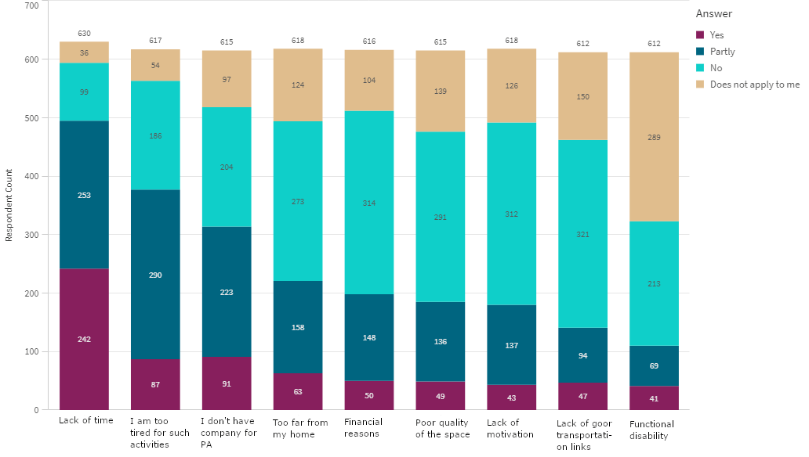

```{r setup, include=FALSE}
knitr::opts_chunk$set(echo = TRUE, warning = F)
options(stringsAsFactors = FALSE)
```

# Statistični testi

Večina klasičnih statističnih testov in modelov je vgrajenih že v osnovni R. Poglejmo si uporabo treh izmed najbolj popularnih, t-testa, ANOVE in linearne regresije.

```{r}
# Modelirajmo porabo goriva, pri čemer kot neodvisne spremenljivke uporabimo:
# število cilindrov, konjsko moč in težo.
lr <- lm(mpg ~ cyl + hp + wt, data = mtcars)
summary(lr)
```


```{r}
# t-test uporabimo za statistično primerjavo pričakovane širine listov
# dveh vrst perunike.
x_vir <- iris$Sepal.Width[iris$Species == "virginica"]
x_ver <- iris$Sepal.Width[iris$Species == "versicolor"]

t.test(x_vir, x_ver)
```


```{r}
# ANOVO uporabimo za statistično primerjavo dolžine listov treh vrst perunike.
# Primerjamo, ali vrsta perunike vpliva na dolžino listov.
my_anova <- aov(Sepal.Length ~ Species, data = iris)
summary(my_anova)
```

# ggplot2 -- statistična značilnost
Včasih želimo rezultate statističnega testa prikazati kar na grafu. Poglejmo si sedaj primer t-testa v ggplot2. Za to bomo potrebovali še en paket **ggpubr** in funkcijo iz tega paketa `stat_compare_means`. Poleg statističnega testa bomo izrisali tudi boxplot (Diagram s *škatlami in brčicami*).


```{r}
library(ggplot2)
library(ggpubr)
ggplot(iris, aes(x = Species, y = Petal.Width)) +
  geom_boxplot() +
  stat_compare_means(label = "p.signif", method = "t.test",
                     ref.group = "setosa")
```

# Prikaz točk in povprečja na grafu
Poglejmo si še en zanimiv graf, kjer bomo prikazali točke in povprečja na istem grafu. Pogledali si bomo porazdelitve dolžin in širin čašnih listov različnih perunik. Najprej si pripravimo `data.frame`.

```{r}
library(tidyr)
iris_longer <- iris[ , c("Sepal.Length", "Sepal.Width", "Species")]
iris_longer <- pivot_longer(iris_longer, Sepal.Length:Sepal.Width)
head(iris_longer)
```

Za izris povprečij s črto bomo potrebovali geom `hpline` iz paketa **ungeviz** (https://wilkelab.org/ungeviz/index.html). Za izris točk uporabimo pri `geom_point` argument `position = position_jitterdodge()`. To najprej loči dolžine in širine listov (dodge) in potem še nekoliko raztrosi točke (jitter), da je bolj pregledno, kjer imamo več točk. Če ne bi uporabili tega, bi enostavno dobili prikazane vse točke v isti liniji.

Instalacija devtools::install_github("wilkelab/ungeviz")

```{r}
library(ungeviz)
pl_means <- 
  ggplot(iris_longer, aes(x = Species, y = value, color = name)) +
  geom_point(position = position_jitterdodge()) +
  stat_summary(
    fun = "mean",
    position = position_dodge(width = 0.75),

        geom = "hpline"
  )
pl_means
```
# ggplot2 -- errorbar

Na statističnih grafih, ki vsebujejo opisne statistike, kot je npr. povprečje, pogosto prikažemo še negotovost v obliki standardnih odklonov ali standardnih napak. S knjižnico ggplot2 to storimo z uporabo geom-a `errorbar`. Pred tem moramo ustrezno pripraviti podatke tako, da dodamo še stolpec s spodnjo in zgornjo mejo napake. Če je napaka simetrična, potrebujemo le en stolpec. Poglejmo si odvisnost milj na galono (`mpg`) od števila cilindrov.

```{r}
data("mtcars")
head(mtcars)

mus <- aggregate(mpg ~ cyl, mtcars, FUN = mean)
sds <- aggregate(mpg ~ cyl, mtcars, FUN = function(x) {sd(x) / sqrt(length(x))})
df  <- cbind(mus, SE = sds$mpg)
df$cyl <- as.character(df$cyl)

head(df)
```


```{r fig.width = 3, fig.height = 3}
library(ggplot2)
ggplot(df, aes(x = cyl, y = mpg, colour = cyl)) + 
  geom_point() + 
  geom_errorbar(aes(ymin = mpg - SE, ymax = mpg + SE), width = 0.5) +
  theme(legend.position = "none")
```


# Risanje stolpičnih diagramov

Želimo izrisati podatke anket, kjer so anketiranci odgovarjali na vprašanja o vzrokih zakaj se rekreirajo manj kot pet krat tedensko. Odgovori so bili ponujeni vnaprej, odgovarjali pa so z "Da", "Delno", "Ne" in "Zame ne velja", glede na to, če menijo, da se odgovor sklada z njihovimi vzroki. Vprašanja so lahko pustili tudi neodgovorjena. 

Najprej poglejmo, kako so bili odgovori shranjeni.

```{r}
library(openxlsx)
anketa_raw <- read.xlsx("./data_raw/vpr_predavanje_8.xlsx")
head(anketa)
```

Iz podatkov lahko razberemo, da vsak stolpec predstavlja vprašanje, vsaka vrstica pa enega anketiranca. Odgovori so zakodirani s številkami in sicer:

* < 0: **Neodgovorjeno**
* 1: **Da**
* 2: **Delno**
* 3: **Ne**
* 4: **Zame ne velja**

Iz teh podatkov želimo izrisati podoben graf, kot je na spodnji sliki.

 

Poskušajmo sedaj ustvariti čim bolj podoben graf v R-ju.

Najprej nekoliko predelajmo vhodne podatke, saj namesto številk lahko v R-ju uporabimo faktorje, da so podatki bolj razumljivi. Manjkajoče vrednosti (negativne) zamenjamo z *NA*, ostalim pa priredimo podane odgovore.


```{r}
anketa <- anketa_raw
anketa[anketa < 0] <- NA
anketa[anketa == 1] <- "Da"
anketa[anketa == 2] <- "Delno"
anketa[anketa == 3] <- "Ne"
anketa[anketa == 4] <- "Zame ne velja"
head(anketa)
```
Trenutno smo pretvorili odgovore v tip *character* sedaj pa jih lahko še v *faktor*.
```{r}
anketa[] <- lapply(anketa, factor, levels = c("Da", "Delno",
                                              "Ne", "Zame ne velja"))
head(anketa)
```

Postopek lahko naredimo tudi direktno. Tukaj moramo paziti, da podamo argumenta *levels* in *labels*, kjer istoležne vrednosti predstavljajo pretvorbo. Primer `1 = "Da", 2 = "Delno"` itd..

```{r}
an2 <- anketa_raw
an2[] <- lapply(anketa_raw, factor, levels = c(1,2,3,4), 
                labels = c("Da", "Delno", "Ne", "Zame ne velja"))
head(an2)
```

Za izris podatkov s funkcijo *ggplot* ta oblika ni primerna. Boljša je dolga oblika, kjer bi imeli en stolpec z vprašanjem in drugi z odgovorom. Pretvorimo v podatke z uporabo *pivot_longer*.

```{r}
library(tidyr)
anketa_long <- pivot_longer(anketa, 1:ncol(anketa),
                            names_to = "Vprasanje",
                            values_to = "Odgovor")
anketa_long
```

Opazimo lahko, da sta prva in deseta vrstica enaki. Nas za izris zanima koliko je bilo takšnih odgovorov, zato moramo za vsako kombinacijo vprašanja in odgovora prešteti število vrstic. To lahko naredimo s funkcijo *table*.

```{r}
table(anketa_long)
```

Funkcija *table* je našo tabelo spremenila nazaj v širšo obliko. Rezultat je v ozadnju sicer še vedno skrit v dolgi obliki. Poglejmo, kakšen izpis dobimo, če ta rezultat pretvorimo v *data.frame*.


```{r}
head(data.frame(table(anketa_long)))
```

Če želimo, rezultat *table* shraniti v enaki obliki kot je v izpisu jo lahko sami pretvorimo v širšo obliko. Spremenljivko `anketa_counts` bomo potrebovali kasneje, zato jo shranimo. Če želite prešeti manjkajoče vrednosti lahko nastavite parameter `useNA = "ifany"` ali `useNA = "always"`.

```{r}
anketa_counts <- pivot_wider(data.frame(table(anketa_long, useNA = "no")), 
                             names_from = "Odgovor", values_from = "Freq")
anketa_counts
```
Samo za primer poglejmo, kako bi to tabelo spremenili nazaj v dolgo obliko s funkcijo *pivot_longer*. Če ste pozorni, opazite, da se je sedaj stolpec **Odgovor** spremenil v tip **character**.

```{r}
anketa_fin <- pivot_longer(anketa_counts, 2:5, names_to = "Odgovor", values_to = "Stevilo")
anketa_fin
```

Uporabimo sedaj podatke v `anketa_fin` za izris stolpičnega diagrama. Pri tem določimo parameter `fill` za izbiro barve vsakega dela stolpca. Izbrali bomo `theme_bw`, ki se najbolj ujema z željenim ozadnjem.


```{r}
library(ggplot2)
ggplot(anketa_fin, aes(x = Vprasanje, y = Stevilo, fill = Odgovor)) +
  geom_bar(stat = "identity") +
  #belo ozadje
  theme_bw()
```
Zgornjemu diagramu od željenih elementov manjka le še izpis številk. Ostale vrednosti pa so prikazane vendar bi želeli diagram še polepšati. Za začetek spremenimo text na x in y osi ter dodajmo število odgovorov na vsak stolpec. To naredim z `geom_text`, kjer povemo naj izpisuje vrednost **Stevilo** z `aes(label=Stevilo)`, z `position_stack` pa povemo, da želimo tekst na stolpcih, pri tem `vjust` vertikalno premakne izpis na sredino, privzeto pa je na vrhu. Določimo še belo barvo in velikost pisave. 

```{r}
ggplot(anketa_fin, aes(x = Vprasanje, y = Stevilo, fill = Odgovor)) +
  geom_bar(stat = "identity") +
  #belo ozadje
  theme_bw() +
  ylab("Respondent Count") +
  xlab("") +
  #Dodamo tekst na graf
  geom_text(aes(label=Stevilo),
            position = position_stack(vjust = 0.5),
            color="white",
            size=4)
```
            
Opazite lahko, da imamo na diagramu izpisane tudi vrednost 0 za manjkajoče vrednosti. Ker tega ne želimo, je najlažje, da te vrednosti preprosto odstranimo iz vhodnih podatkov. 

```{r}
anketa_fin <- anketa_fin[anketa_fin$Stevilo != 0,]
ggplot(anketa_fin, aes(x = Vprasanje, y = Stevilo, fill = Odgovor)) +
  geom_bar(stat = "identity") +
  #belo ozadje
  theme_bw() +
  ylab("Respondent Count") +
  xlab("") +
  #Dodamo tekst na graf
  geom_text(aes(label=Stevilo),
            position = position_stack(vjust = 0.5),
            color="white",
            size=4)
```

Vrstni red stolpcev je privzeto odvisen kar od abecednega vrstnega reda imen stolpcev. Če želimo izbrati drugi vrstni red lahko uporabimo ´reorder´, vendar moramo podati želeni vrstni red. Vrstni red lahko določimo, glede na število odgovorov z "Da". Za to uporabimo prej shranjeno tablo *anketa_counts*.

```{r}
vrstni_red <- anketa_counts[order(anketa_counts$Da),]$Vprasanje
vrstni_red
```


Nekatera vprašanja imajo enako število odgovorov z vrednostjo "Da". Če želimo znotraj teh urediti po drugem atributu lahko te preposto dodamo funkciji *order*. Uredimo vrstni red po vseh stolpcih.

```{r}
vrstni_red <- anketa_counts[order(anketa_counts$Da,
                                  anketa_counts$Delno,
                                  anketa_counts$Ne,
                                  anketa_counts$`Zame ne velja`),]$Vprasanje
vrstni_red
```

Z for zanko se lahko sprehodimo, čez vektor *vrstni_red* in podatkom, podamo stolpec, ki bo vplival na vrstni red izpisa. Z zadnji vrstici zanke bi lahko vpisovali ´-i´, vendar so pozitivna števila lažje razumljiva.

```{r}
anketa_fin$ord <- 0
for(i in 1:length(vrstni_red)){
  #izberemo vse vrstice, ki pripadajo i-temu vprašanju
  sel <- anketa_fin$Vprasanje == vrstni_red[i]
  #dodamo pravilni indeks v ord
  anketa_fin[sel, "ord"] <- length(vrstni_red) - i
}
anketa_fin
```

Izrišimo sedaj stolpce v tem vrstnem redu.


```{r}
ggplot(anketa_fin,
       aes(x = reorder(Vprasanje, ord), y = Stevilo, fill = Odgovor)) +
  geom_bar(stat = "identity") +
  #belo ozadje
  theme_bw() +
  ylab("Respondent Count") +
  xlab("") +
  #Dodamo tekst na graf
  geom_text(aes(label=Stevilo),
            position = position_stack(vjust = 0.5),
            color="white",
            size=4)
```

Vrstni red izpisa stolpcev smo sedaj določili. Opazimo pa lahko, da je vrednost "Da" sedaj na vrhu namesto spodaj, kot bi si želeli. Vrstni red vresnosti v stolpcu, je ponovno določen z abecednim vrstnim redom, ker uporabljamo spremenljivko tipa **character**. Če uporabimo tip **factor**, pa bo vrstni red določen z vrednostmi v faktorju. Vrednosti moramo v *levels* podati od zgoraj navzdol.


```{r}
anketa_fin$Odgovor <- factor(anketa_fin$Odgovor, levels = c("Zame ne velja", "Ne",
                                                            "Delno", "Da"))
```


```{r}
ggplot(anketa_fin,
       aes(x = reorder(Vprasanje, ord), y = Stevilo, fill = Odgovor)) +
  geom_bar(stat = "identity") +
  #belo ozadje
  theme_bw() +
  ylab("Respondent Count") +
  xlab("") +
  theme(legend.position = "right") +
  #Dodamo tekst na graf
  geom_text(aes(label=Stevilo),
            position = position_stack(vjust = 0.5),
            color="white",
            size=4)
```

V primeru so namesto stolpcev vzroki dejansko opisani s stavki in so v razporejeni čez več vrstic. Opis lahko zamenjamo kar tako, da popravimo vrednosti v stolpcu **Vprasanje**. Da to storimo moramo spet vsako vrednost zamenjati z drugo! Ta postopek smo že srečali, ko smo menjali 1 z "Da", 2 z "Delno" itd.

V primeru, da se nam postopek ponavlja, ga je smiselno posplošiti in napisati funkcijo. S tem enake kode ne popravljamo na več mestih v skripti ampak le na enem: v funkciji. Napišimo svojo funkcijo, ki bo znala zamenjati eno vrednost z drugo.


```{r}
zamenjaj <- function(vektor, obstojece, nove){
  nov_vektor <- vector("logical", length = length(vektor))
  for(i in 1:length(obstojece)){
    nov_vektor[vektor == obstojece[i]] <- nove[i]
  }
  return(nov_vektor)
}
#primer
zamenjaj(c(1,2,3,1,3,2,2,1,2), c(1,2,3), c("a", "b", "c"))
```

Funkcija sprejme 3 vektorje. Prvi vektor želimo spremeniti, v drugem vektorju moramo podati vrednosti, ki jih želimo menjati in v tretjem nove vrednosti. Drugi vektor lahko programsko določimo z *unique*, vendar je včasih preglednejše, da podamo oba vektroja, kjer lahko spreminjamo vrstni red.

Postopek menjave ene vrednosti z drugo je zelo pogost, zato že obstajajo druge funkcije, ki jih lahko uporabite, kot so naprimer **case_when()**, **recode()**, **gsub()**. Vsaka funkcija ima svoje posebnosti, naša funkcija **zamenjaj** zna zamenjati le eno vrednost z drugo. Ne moremo pa recimo zamenjati vseh negativnih števil z nizom "negativno".


Vseeno jo uporabimo.


```{r}
unique(anketa_fin$Vprasanje)
opisi <- zamenjaj(anketa_fin$Vprasanje, unique(anketa_fin$Vprasanje),
                 c("Too far from my home",
                   "Lack of good transportation links",
                   "Poor quality of space",
                   "Functional disability",
                   "Lack of time",
                   "Financial reasons",
                   "I don't have company for PA",
                   "I am too tired for such activities",
                   "Lack of motivation"))
anketa_fin$Vprasanje <- opisi
```

Če sedaj izrišemo graf vidimo, da imamo zaradi daljših opisov še več prekrivanj teksta na x osi. To lahko rešimo ročno, tako da vnesemo znak "\\n", ki pomeni novo vrstico v naše nize. 

```{r}
ggplot(anketa_fin, aes(x = reorder(Vprasanje, ord), y = Stevilo, fill = Odgovor)) +
  geom_bar(stat = "identity") +
  #belo ozadje
  theme_bw() +
  ylab("Respondent Count") +
  xlab("") +
  theme(legend.position = "right") +
  #Dodamo tekst na graf
  geom_text(aes(label=Stevilo),
            position = position_stack(vjust = 0.5),
            color="white",
            size=4)
```

Uporabimo pa lahko paket **stringr** za delo z nizi, ki že vsebuje funkcijo **str_wrap**, ki nam razdeli nize na več vrstic. Preizkusimo:


```{r}
library(stringr)

str_wrap("Ta stavek je dokaj dolg!", width = 10)
```

Te spremembe lahko ponovno naredimo, kar v tabeli, lahko pa jih uporabimo le pri izpisu diagrama, tako da definiramo svojo funkcijo kar znotraj klica **ggplot**. Tukaj moramo parameter *width* določiti na roke. Primerna širina je nekoliko odvisna od velikosti izhodne slike, ki pa se razlikuje, če želimo sliko shraniti v ta izroček oziroma, če sliko izrišemo na celoten ekran. Če so stavki zelo dolgi lahko spremenimo še velikost pisave z `theme(axis.text.x = element_text(size = 5))`. Če boste poganjali kodo izven te skripte, lahko nastavite `width = 15` in spustite zmanjšavanje teksta na x osi.

```{r}
ggplot(anketa_fin, aes(x = reorder(Vprasanje, ord), y = Stevilo, fill = Odgovor)) +
  geom_bar(stat = "identity") +
  #belo ozadje
  theme_bw() +
  ylab("Respondent Count") +
  xlab("") +
  theme(legend.position = "right") +
  #Dodamo tekst na graf
  geom_text(aes(label=Stevilo),
            position = position_stack(vjust = 0.5),
            color="white",
            size=4) +
  scale_x_discrete(labels = function(x) {str_wrap(x, width = 10)}) +
  theme(axis.text.x = element_text(size = 5))

```

V primeru vidimo, da je legenda desno zgoraj. **ggplot** nam privzeto izriše legendo na desni, imamo pa še možnosti, da jo izrišemo levo, spodaj ali zgoraj s tem, da nastavimo `legend.position` na eno izmed vrenosti "left", "bottom" ali "top". Če želimo legendo podati na poljubno mesto lahko podamo par števil *c(x, y)*, kjer vrednost c(0, 0) predstavlja spodnji levi rob c(1, 1), pa zgornji desni rob. Privzeto bo na izrani poziciji sredina legende, če pa želimo na tej poziciji izbrati levi zgornji kot, pa to podobno nastavimo z `legend.justification = c(0,1)`. V primeru, da legendo ročno premaknemo z `c(x,y)` se izriše le graf brez dodatnega prostora, ki pa ga lahko dodamo na desno z parametrom `plot.margin = margin(top, right, bottom, left, unit)`. S to funkcijo spodaj dodamo diagramu 4.5 cm prosotra na desni.

```{r}
ggplot(anketa_fin, aes(x = reorder(Vprasanje, ord), y = Stevilo, fill = Odgovor)) +
  geom_bar(stat = "identity") +
  #belo ozadje
  theme_bw() +
  ylab("Respondent Count") +
  xlab("") +
  theme(legend.position = c(1.01, 0.98),
        legend.justification = c(0, 1)) +
  theme(plot.margin = margin(0, 4.5, 0, 0, "cm")) +
  #Dodamo tekst na graf
  geom_text(aes(label=Stevilo),
            position = position_stack(vjust = 0.5),
            color="white",
            size=4) +
  scale_x_discrete(labels = function(x) {str_wrap(x, width = 10)}) +
  theme(axis.text.x = element_text(size = 5))

```


Na koncu zamenjajmo še barve na grafu! Ročno jih lahko izbiramo s funkcijo **scale_fill_manual** ali pa uporabimo že privzete palete z **scale_fill_brewer**. Barve lahko izbiramo z že privetimi imeni, funkcijo **rgb** ali s tem, da napišemo vrednosti rgb v heksadecimalni obliki kot niz. Poglejmo na spodnjem primeru.
                               
```{r}
ggplot(anketa_fin, aes(x = reorder(Vprasanje, ord), y = Stevilo, fill = Odgovor)) +
  geom_bar(stat = "identity") +
  #belo ozadje
  theme_bw() +
  ylab("Respondent Count") +
  xlab("") +
  theme(legend.position = c(1.01, 0.98),
        legend.justification = c(0, 1)) +
  theme(plot.margin = margin(0, 4.5, 0, 0, "cm")) +
  #Dodamo tekst na graf
  geom_text(aes(label=Stevilo),
            position = position_stack(vjust = 0.5),
            color="white",
            size=4) +
  scale_x_discrete(labels = function(x) {str_wrap(x, width = 10)}) +
  theme(axis.text.x = element_text(size = 5)) + 
  scale_fill_manual(values = c("burlywood",#lahko po imenih(blizu (224, 189, 141))
                               rgb(15, 207, 201, maxColorValue = 255),
                               rgb(0, 101, 128, maxColorValue = 255),
                               "#871F5D"))
```

Spremenimo še barvo teksta glede na vrednost, ki jo prikazuje. Tukaj lahko preprosto uporabimo našo že napisano funkcijo **zamenjaj**!

```{r}
ggplot(anketa_fin, aes(x = reorder(Vprasanje, ord), y = Stevilo, fill = Odgovor)) +
  geom_bar(stat = "identity") +
  #belo ozadje
  theme_bw() +
  ylab("Respondent Count") +
  xlab("") +
  theme(legend.position = c(1.01, 0.98),
        legend.justification = c(0, 1)) +
  theme(plot.margin = margin(0, 4.5, 0, 0, "cm")) +
  #Dodamo tekst na graf
  geom_text(aes(label=Stevilo),
            position = position_stack(vjust = 0.5),
            color=zamenjaj(anketa_fin$Odgovor, c("Zame ne velja", "Ne", "Delno", "Da"),
                           c("black", "black", "white", "white")),
            size=4) +
  scale_x_discrete(labels = function(x) {str_wrap(x, width = 10)}) +
  theme(axis.text.x = element_text(size = 5)) +
  scale_fill_manual(values = c("burlywood",#lahko po imenih(blizu (224, 189, 141))
                               rgb(15, 207, 201, maxColorValue = 255),
                               rgb(0, 101, 128, maxColorValue = 255),
                               "#871F5D"))
```

# Organizacija podatkov in krajša analiza

Poglejmo si dobljene podatke:
                        
```{r}
data <- read.table("C:/delavnice/R-za-neprogramerje/Predavanje_08/data_raw/test_data.csv",
                        header = T,
                        dec = ".",
                        sep = ";",
                        quote = ""
                        )
head(data)
```
                        
Imamo rezultate bioloških poskusov, kjer je vsak poskus narejen v treh tehničnih replikantih. Radi bi opravljali analizo tako, da računamo statistike (povprečja) vsakega poskusa posebej. Pri analizi bi radi ohranili tudi ohranili vse podatke in okvirno naredili naslednjo analizo:

1. Preveri Tm vrednosti in zavrzi vse podatke, ki imajo Tm vrednost izven območja 81.0-81.7.
2. Za vsak vzorec preveri outlierje: če se Cq vrednost replikata razlikuje za >1 od mediane treh replikatov, jo zavrzi.
3. Če ima vzorec vsaj dva pozitivna replikata, je pozitiven, sicer negativen.
4. Izračunaj povprečno Cq za vse pozitivne vzorce.

Za takšno analizo so podatki že v primerni obliki in nam jih ni potrebno preoblikovati z **pivot_longer** ali **pivot_wider**. Poglejmo si par primerov, kako bi naredili takšno analizo.


## Rešitev 1

Najprej poglejmo rešitev z snovjo, ki smo jo že spoznali. Rešitev bo sicer odstranjevala vrstice, za katere med analizo ugotovimo, da so neustrezne.

```{r}
dim(data)
```

Imejmo v mislih, da imamo na začetku 10 poskusov, vsak pa ima 3 replikante, torej imamo 30 vrstic. Posamezni koraki bodo tudi shranjeni v svoje tabele, kar seveda lahko preskočimo.

### Korak 1

Preveri Tm vrednosti in zavrzi vse podatke, ki imajo Tm vrednost izven območja 81.0-81.7.

```{r}
step1 <- data[data$Tm >= 81.0 & data$Tm <= 81.7,]
dim(step1)
```

### Korak 2


Za vsak vzorec preveri outlierje: če se Cq vrednost replikata razlikuje za >1 od mediane treh replikatov, jo zavrzi.

Najprej opazimo, da je vrednost **Cq** tipa **character**, ker vsebuje tudi znak "N". Če pretvorimo te podatke v numerične se bo ta vrednost zamenjala z **NA**. Ker so to manjkajoči podatki jih nato tudi odstranimo.

```{r}
step2 <- step1
step2$Cq <- as.numeric(step2$Cq)
step2 <- step2[!is.na(step2$Cq),]
dim(step2)
```

Sedaj pa lahko izračunamo mediano za vsako skupino. Tukaj si lahko pomagamo s funkcijo **aggregate**.

```{r}
mediane <- aggregate(step2$Cq, by = list(step2$Sample), FUN = median, na.rm = T)
names(mediane) <- c("skupina", "mediana")
mediane
```

Pripnimo te mediane k našim podatkom. Ker sta tabeli različni moramo podatke združiti s funkcijo **merge**. Funkciji podamo obe tabeli in z parametroma `by.x` in `by.y` povemo, po katerih vrednostih naj združuje.

```{r}
step2 <- merge(step2, mediane, by.x = "Sample", by.y = "skupina")
step2 <- step2[step2$mediana < step2$Cq + 1 & step2$mediana > step2$Cq - 1, ]
step2
```


### Korak 3

Če ima vzorec vsaj dva pozitivna replikata, je pozitiven, sicer negativen.

```{r}
step3 <- step2
table(step3$Sample)
```

Z ukazom table lahko hitro vidimo, da imata poskus 4 in 6 le en replikant, poskus 9 pa celo manjka. Predpostavimo, da so pozitivni tisti, ki ostajajo. Dodajmo nov stolpec velikost skupine, k naši originalni tabeli. Uporabimo pa kar isti postopek kot v koraku 2, le da zamenjamo funkcijo **median** z **length**.

```{r}
velikosti <- aggregate(step3$Sample, list(step3$Sample), FUN = length)
names(velikosti) <- c("Skupina", "n")
velikosti
```

```{r}
step3 <- merge(step3, velikosti, by.x = "Sample", by.y = "Skupina")
step3 <- step3[step3$n > 1,]
step3
```

### Korak 4

Izračunaj povprečno Cq za vse pozitivne vzorce.

Spet po istem postopku spet izračunamo povprečje. Postopek se ponavlja... premislite, če bi naredili funkcijo.

```{r}
step4 <- step3
povprecja <- aggregate(step4$Cq, list(step4$Sample), FUN = mean)
names(povprecja) <- c("Skupina", "Povprecje")
povprecja
```

Od tukaj naprej lahko povprečja uporabljamo za nadaljnjo analizo ali pa jih pridružimo začetnim podatkom.

```{r}
step4 <- merge(step3, povprecja, by.x = "Sample", by.y = "Skupina")
step4
```

## Rešitev 2

Podobno kot prej, le da bomo ohranjali vse vrstice in si pri vsaki le vodili evidenco ali je aktualna ali ne. V tem postopku tudi ne bomo delali tabel za vsak korak ampak bomo uporabljali le eno *dataNA*.


### Korak 1

Preveri Tm vrednosti in zavrzi vse podatke, ki imajo Tm vrednost izven območja 81.0-81.7.

```{r}
dataNA <- data
dataNA$Valid <- TRUE
dataNA$Valid <- dataNA$Tm >= 81.0 & dataNA$Tm <= 81.7
dataNA
```

Dodali smo stolpec **Valid**, ki nam pove ali je replikant pozitiven ali ne. Tiste, ki ne ustrezajo prvemu koraku označimo z **FALSE**.

### Korak 2

Za vsak vzorec preveri outlierje: če se Cq vrednost replikata razlikuje za >1 od mediane treh replikatov, jo zavrzi.


Vrstice, kjer je Cq = "N" zavrnemo.

```{r}
dataNA$Cq <- as.numeric(dataNA$Cq)
dataNA$Valid <- dataNA$Valid & !is.na(dataNA$Cq)
dataNA
```

Podobno kot prej izračunamo mediane, vendar pazimo, da uporabljamo le podatke, kjer je *Valid = T*.


```{r}
mediane <- aggregate(dataNA$Cq[dataNA$Valid], by = list(dataNA$Sample[dataNA$Valid]), FUN = median, na.rm = T)
names(mediane) <- c("skupina", "mediana")
dataNA <- merge(dataNA, mediane, by.x = "Sample", by.y = "skupina", all = TRUE)
dataNA$Valid <- dataNA$Valid & (dataNA$mediana < dataNA$Cq + 1 & dataNA$mediana > dataNA$Cq - 1)
dataNA
```

### Korak 3

Če ima vzorec vsaj dva pozitivna replikata, je pozitiven, sicer negativen.


```{r}
velikosti <- aggregate(dataNA$Sample[dataNA$Valid], list(dataNA$Sample[dataNA$Valid]), FUN = length)
names(velikosti) <- c("Skupina", "n")
dataNA <- merge(dataNA, velikosti, by.x = "Sample", by.y = "Skupina", all = TRUE)
dataNA$Valid <- dataNA$Valid & dataNA$n > 1
dataNA
```
### Korak 4


Izračunaj povprečno Cq za vse pozitivne vzorce.


```{r}
povprecja <- aggregate(dataNA$Cq[dataNA$Valid], list(dataNA$Sample[dataNA$Valid]), FUN = mean)
names(povprecja) <- c("Skupina", "Povprecje")
povprecja
```

Ponovno lahko združimo podatke.

```{r}
dataNA <- merge(dataNA, povprecja, by.x = "Sample", by.y = "Skupina", all = T)
dataNA
```

Iz celotne množice lahko sedaj preprosto tudi dobimo povprečja, kjer je vidno tudi kateri poskusi so negativni.

```{r}
unique(dataNA[, c("Sample", "Povprecje")])
```

## Rešitev 3

Ta rešitev prikazuje, da so podatki že v zelo čisti obliki in se jih je preprosto uporabiti za analizo v okolju paketov **tidyverse**, ki naredi delo z R-jem še bolj pregledno.

Iz tega okolja smo že uporabljali funkcije **ggplot**, **pivot_longer** in **pivot_wider**. 

Naslednja rešitev uporablja pipe operator %>%, ki le poda podatke iz leve strani na desno kot prvi argument. Primer:

```{r}
sin(c(1,2,3))
c(1,2,3) %>% sin()
```

Poglejmo našo analizo:

```{r}
library(dplyr)
data$Cq <- as.numeric(data$Cq) #tudi to bi lahko dodali v pipe
data %>%
  filter(Tm >= 81.0 & Tm <= 81.7) %>% #Korak 1
  group_by(Sample) %>% #Določimo, da želimo delati glede na Sample
  mutate(mediana = median(Cq, na.rm = T)) %>% #izračun median
  filter(mediana < Cq + 1 & mediana > Cq - 1) %>%#filtiranje outlierjev (Korak2)
  mutate(velikost = n()) %>% #Izračun velikosti
  filter(velikost > 1) %>% #Korak 3
  mutate(povprecje = mean(Cq)) %>% #Izračun povprečji (Korak 4)
  select(Sample, povprecje) %>% #Izberemo le dva stolpca
  unique() #Samo unikatne vrstice
```


# Avtomatsko generiranje kombinacij in shranjevanje slik


Včasih želimo narediti enako analizo za več različnih podmnožic stolpcev. Če želimo našteti vse različne kombinacije lahko to preprosto naredimo s funkcijo **combn**.

Poglejmo primer z uporabo podatkov **mtcars**.

```{r}
data("mtcars")
head(mtcars)
```

Najprej naštejmo vse kombinacije stolpcev. Funkcija **combn** naredi vse kombinacije podanega vektorja, velikost kombinacij pa izberemo z drugim argumentom.

```{r}
combn(names(data), 3)
```

Če želimo, da se vrednosti tudi ponavljajo lahko uporabimo **expand.grid**. Tej funkciji podamo več vektorjev in nam vrne vse kombinacije vrednosti.

```{r}
test <- expand.grid(names(data), names(data), names(data))
head(test)
```

<!-- #samo omeni paket "plotly" ponuja iteraktivnost grafov -->

Radi bi izrisali ternarni graf za vse možne kombinacije atributov podatkovne množice **mtcars**. Naložimo najprej paket library in si poglejmo primer takega diagrama. Pozor paket **ggtern** po prepisal nekatere funkcije **ggplota**. Če jih želite uporabljati morate ponovno naložiti paket **ggplot** z ´library(ggplot)´.

Diagram za stolpce **mpg**, **qsec** in **wt**.

```{r}
library(ggtern)
ggtern(data=mtcars,aes(x=mpg,y=qsec, z=wt)) +
  geom_point()
```

Za nameščanje paketa **ggtern** potrebujete trenutno najnovejšo verzijo R-ja in sicer 4.2.2. Če imate starejši R vas bo pri nalaganju paketa le-ta opozoril, da imate zastarelo verzijo namespace methods. Ker je to osnovni del R-ja ga morate ponovno namestiti. Vse lahko poženete tudi direktno iz R-ja oziroma je bolje da uporabite RGui.

```{r eval = FALSE}
#Če imate težave z namespace (methods)
install.packages(installr)
library("installr")
updateR() #iz RGui - posodobi instalacijo R-ja

install.packages("ggtern") #naložite še paket
```


Shranimo si vse kombinacije, ki jih potrebujemo. Za lažje delo bomo kombinacije tudi transponirali - zamenjali vrstice in stolpce v tabeli z ukazom **t**.

```{r}
kombinacije <- combn(names(mtcars), 3)
dim(kombinacije)
kombinacije <- t(kombinacije)
head(kombinacije) 
```

Spišimo sedaj funkcijo, ki nam izriše ternarni diagram za podane stolpce. Pozor: tokrat smo za aestetike namesto **aes** uporabili **aes_string** za katerega so se razvijalci paketa odločili, da ga čez nekaj časa ne bodo več podpirali. Če ste opazili pri uporabi **ggplot** in posledično **ggplot** imen stolpcev ni potrebno navesti v narekovajih, kar privede do težje uporabe, če imamo ime stolpca shranjeno v spremenljivki. Uporaba **aes_string** je v tem primeru najpreprostejša rešitev.

```{r}
izrisi_ternarni_diagram <- function(stolpci, podatki){
  ggtern(data=podatki,aes_string(x = stolpci[1], y = stolpci[2],z = stolpci[3])) +
    geom_point()
}
izrisi_ternarni_diagram(c("mpg", "qsec", "wt"), mtcars)
izrisi_ternarni_diagram(c("mpg", "qsec", "disp"), mtcars)
```

Zgornja funkcija samo prikazuje rešitev za izbiro stolpcev, napišimo sedaj funkcijo, ki bo naše grafe shranila na disk. Če želite pognati naslednji izsek kode, morate v mapi *data_raw* ustvariti še mapo *ternarni_diagrami*.

```{r eval = FALSE}
setwd("C:/delavnice/R-za-neprogramerje/Predavanje_08")
shrani_ternarni_diagram <- function(stolpci, podatki){
  #izrisi graf in ga shrani
  slika <- ggtern(data=podatki,aes_string(x = stolpci[1], y = stolpci[2],z = stolpci[3])) +
    geom_point()
  #ustvari ime datoteke in jo shrani (lahko dodamo parametre)
  pot <- paste(getwd(),
               "./data_raw/ternarni_diagrami/",
               stolpci[1], "_",
               stolpci[2], "_",
               stolpci[3], "_",
               ".png", sep = "")
  print(pot)
  ggsave(pot, slika)
}
#test shranjevanja ene slike
shrani_ternarni_diagram(c("mpg", "qsec", "wt"), mtcars)
#generirano in shranimo vse slike
apply(kombinacije, 1, shrani_ternarni_diagram, podatki = mtcars)

```

Diagrami so v mapi shranjeni z imenom stolpec1_stolpec2_stolpec3.png, kjer je stolpec dejansko ime izbranega stolpca.

Po zagonu bi morali v mapi *ternarni_diagrami* videti shranjene diagrame.


# Osamelci - outliers

Definicija **osamelcev** (ang. **outlier**) je široko področje in njihova zaznava je odvisna od primera do primera. V poglavju Organizacija podatkov in krajša analiza smo imeli definicjo osamelcev podano vnaprej.

Nekaj klasičnih pristopov lahko dobite na [https://statsandr.com/blog/outliers-detection-in-r/](https://statsandr.com/blog/outliers-detection-in-r/) po katerem je povzet tudi ta del skripte.

Osamelci so v splošnem vrednosti, ki (preveč) odstopajo od naših podatkov. Lahko so posledica napačnih meritev ali pa le redkih dogodkov za katereme moramo premisliti ali jih je sploh smiselno odstraniti.

## Metode ostrega očesa

Najlažje je včasih podatke le vizualizirati na način, da so nam osamelci jasno vidni.

Poskušajmo detektirati osamelce v množici **mtcars** za atribut **wt**.

Izrišemo lahko histogram vrednosti.

```{r}
ggplot(mtcars, aes(x = wt)) + geom_histogram(bins = 10)

```
Iz izrisa vidimo, da so 3 vrednosti dokaj visoke in potencialno osamelci.

Drug priročen izris je **boxplot** oziroma škatla z brki.

```{r}
ggplot(mtcars, aes(y = wt)) + geom_boxplot()
```

```{r}
boxplot(mtcars$wt)
```

Pri obeh izrisih so osamelci ozačeni z pikami. Osamelci so pri tem izrisu navadno definirani kot vrednosti, ki so od povprečja oddaljeni za več kot 1.5*(razdalja med prvim in tretjiv kvantilom).

Te vrednosti lahko tudi izpišemo.

```{r}
boxplot.stats(mtcars$wt)$out
```

## Računske metode

Prve vrednosti na katere pomislimo, da bi lahko bili osamelci sta minimalna in maksimalna.

```{r}
range(mtcars$wt)
```

Zelo preprosta metoda je tudi, da za osamelce določimo 2.5% najvišjih in najnižjih vrednosti.

```{r}
spodnja_meja <- quantile(mtcars$wt, 0.025)
zgornja_meja <- quantile(mtcars$wt, 0.975)

mtcars$wt[mtcars$wt < spodnja_meja | mtcars$wt > zgornja_meja]
```

### Hampfel filter

Hamfel filter določi za osamelce vse vrednosti, ki se od mediane oddaljene več kot 3*MAD. Kjer je MAD povprečno absolutno odstopanje od mediane.


```{r}
median(mtcars$wt)
mad(mtcars$wt, constant = 1)
spodnja_meja <- mean(mtcars$wt) - 3*mad(mtcars$wt, constant = 1)
zgornja_meja <- mean(mtcars$wt) + 3*mad(mtcars$wt, constant = 1)

mtcars$wt[mtcars$wt < spodnja_meja | mtcars$wt > zgornja_meja]
```

## Statistične metode

Poglejmo še par statističnih metod, ki predpostavljajo, da so vhodni podatki normalno porazdeljeni.

### Grubbs test

Grubbov test primerja ničelno hipotezo, da najvišja vrednost ni osamelec z hipotezo, da je.

```{r}
library(outliers)
test <- grubbs.test(mtcars$wt) #Dodamo opposite = T, če želimo testirati min
test
```

P vrednost je 0.3083, kar pomeni, da hipoteze, da 5.424 ni osamelec ne zavržemo. Ponavadi jo zavrnemo, če je p < 0.05.

### Dixton test

Dixtonov test deluje podobno kot Grubbsov test, vendar je primeren le za majhno število vrednosti.

```{r}
test <- dixon.test(mtcars[1:30,]$wt)
test
```

Ponovno za maksimalno vrednost velja enako kot pri Grubbsovem testu.

### Rosner test

Z tem testom lahko preverimo več osamelcev hkrati. Iz boxplota smo videli, da sta potencialna dva tako, da bomo preverili oba naenkrat.

```{r}
library(EnvStats)
test <- rosnerTest(mtcars$wt, k = 2)
test
```

Iz izpisa $n.outliers lahko vidimo, da imamo 0 osamelcev in iz $all.stats, da je pri obeh zadnji stolpec FALSE. Če bi imeli osamelce bi stolpec vseboval vrednost TRUE.
