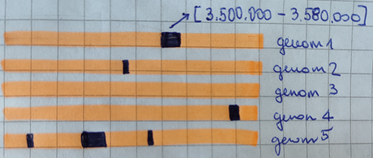
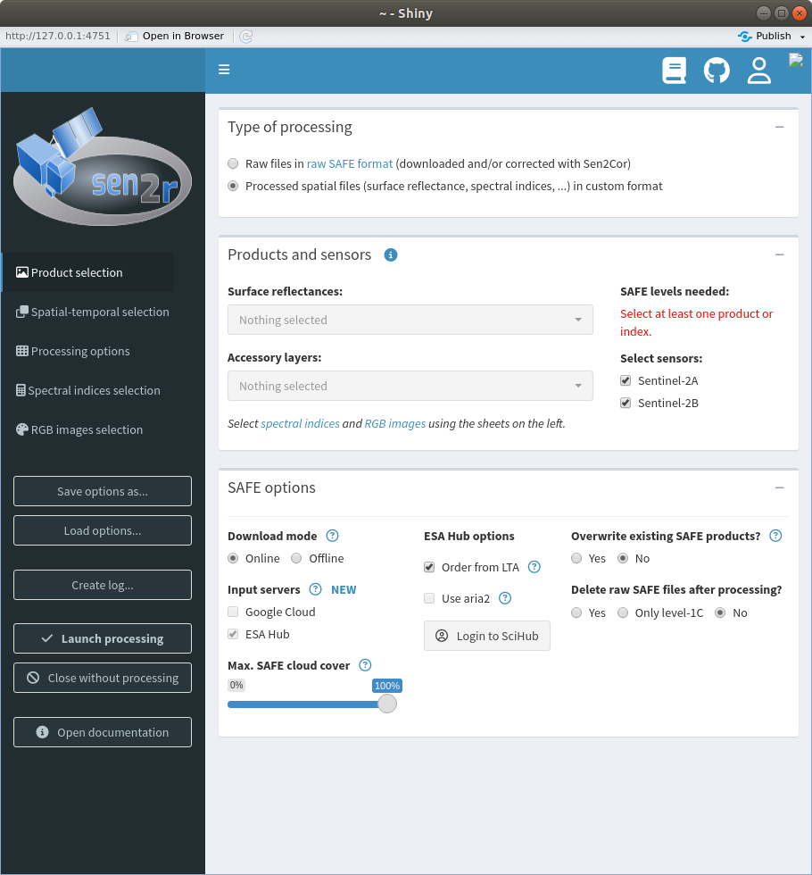

```{r setup, include=FALSE}
knitr::opts_chunk$set(echo = TRUE, warning = F)
options(stringsAsFactors = FALSE)
```

#Delo z mapami in datotekami

Za brskanje po mapah v R-ju obstajajo tri funkcije in sicer `dir()`, `list.files()` in `list.dirs()`. Funkcija `list.dirs()` je najpreporstejša in izpisuje le mape, ostali dve pa sta enaki in omogočata bolj usmerjeno iskanje po mapah in datotekah.

Funkcija `list.dirs()` brez parametrov izpiše vse mape in podmape v trenuti delovni mapi.

```{r}
list.dirs()
```

Izbrano mapo lahko relativno premaknemo z dodajnjem poti v prvem parametru. V mapi *data_raw/podatki/* imamo pripravljeno strukturo map na kateri bomo prikazali primer delovanja teh funkcij.

```{r}
list.dirs("./data_raw/podatki/")
```

Funkcija `list.files()` privzeto izpiše le imena map in datotek v trenutnem direktoriju.

```{r}
list.files("./data_raw/podatki")
```

Če želimo prebrati le datoteke brez map nastavimo dodatne parametre, ki jih ponuja funkcija `list.files()` oziroma lahko uporabimo funkcijo `dir()`, ki naredi enako ima pa le krajše ime. Za ostale parametre si oglejte dokumentacijo z `?dir()`. 

```{r}
datoteke <- dir("./data_raw/podatki", include.dirs = FALSE, recursive = TRUE)
datoteke
```

Kot vidimo so v vektorju `datoteke` vse relative poti vključno z mapami. Z uporabo **for** zanke se lahko preprosto sprehodimo čez vse datoteke in jih vsako posebej obdelamo. Okvirno tako:

```{r, eval=FALSE}
for(d in datoteke){
  #obdeljaj datoteko
}
```

Če imamo informacije skrite v samih imenih datotek oziroma mapah potrebujemo ukaze za delo z nizi, da iz njih izvlečemeo koristne informacije. Zelo na hitro si oglejmo par uporabnih ukazov. Zelo priročen paket za delo z nizi je **stringr**, ki je del paketov **tidyverse**. Naložimo ta paket, da bomo imeli vse funkcije na voljo.

```{r echo = FALSE, warning = FALSE, message = FALSE, error = FALSE}
library(tidyverse)
```

Ena bolj uporabnih funkcij za delo z nizi je strsplit, ki nam omogoča, da niz razbijemo na več manjših podnizov, glede na specifične znake.

```{r}
pokosih <- strsplit("mapa1/mapa2/datoteka.txt", split = "/")
pokosih
```

Funkcija nam vrne vrednosti v seznamu, zato je velikokrat priporočeno, da uporabimo še funkcijo `unlist()`, ki iz seznama ustvari vektor, če je le-to mogoče. Če v takem vektorju indeksiramo zadnji element in delimo pot do datoteke po znaku `/` dobimo ravno ime datoteke.

```{r}
pokosih <- unlist(pokosih)
pokosih[length(pokosih)]
```

Če imamo v imenih datotek na določenem mestu (recimo prvih nekaj znakov) pomemben podatek, ga lahko iz niza izluščimo s funkcijo `substr()`. Primer:

```{r}
podniz <- substr("moj neznan niz znakov", 5, 9)
podniz
```

Nekoliko zahtevnejša funkcija je `grep()`, ki nam pove ali niz vsebuje nek znak ali vzorec. Vrne nam indeks niza v katerem se nahaja iskan niz. V našem primeru je to znak 'a'. Funkcija `grep()` je podobna funkcija, le da vrača logični vektor. 

```{r}
grep("a", c("ah", "oh", "eh", "aha", "pa res"))
grepl("a", c("ah", "oh", "eh", "aha", "pa res"))
```


Če želimo vedeti na katerih mestih znotraj niza se nahaja nek znak lahko uporabimo funkcijo `gregexpr()`.

```{r}
gregexpr("a", "banana")
```

Funkciji `sub()` in `gsub()` (substitution) pa se uporabljajo za menjavo iskanih znakov in vzorcev. Najprej podamo iskani vzorec, nato niz s katerim iskan vzorec zamenjamo in nato naš željen vhodni niz ali nize.

```{r}
gsub("a", "", c("ah", "oh", "eh", "aha", "pa res"))
gsub("[aeiou]", "", c("ah", "oh", "eh", "aha", "pa res"))
gsub("[^aeiou]", "", c("ah", "oh", "eh", "aha", "pa res"))
```

Prvi parameter za opis vzorca vpišemo v obliko regularnega izraza. Razlaga te teme sicer presega obseg tega predavanja, če pa želite izvedeti več oziroma preizkušati regularne izraze je na voljo stran [regex101](https://regex101.com/).

Z regularnimi izrazi lahko zamenjamo oziroma poiščemo številke.

```{r}
gsub("[0-9]+", "$", "crk36in5tev1lk3")
gsub("[^0-9]+", "", "crk3in5tev1lk3")
```

Opis datumov, kot jih imamo v struturi datotek je že nekoliko kompleksnejše in v tej fazi ni mišljeno, da bi že razumeli.
Spodnji primer išče vzorec "številke-številke-številke", kjerkoli v nizu in jih zamejna z skupino med oklepaji, kar pomeni, da ga izlušči.

```{r}
datum <- gsub(".*([0-9]+-[0-9]+-[0-9]+).*","\\1","4-1-2012_S2B.txt")
datum
```

Dobljeni datum je tipa `character()`, kar pomeni, da se primerjave z drugimi datumi delajo leksikografsko, kar pa ni pravilno. Zato je dobro, da nize pretovorim v tip `Date` s funkcijo `as.Date()`.


```{r}
as.Date(datum, format = "%d-%m-%Y")
class(as.Date(datum, format = "%d-%m-%Y"))
```

Sedaj lahko delamo primerjave z datumi.

```{r}
as.Date(datum, format = "%d-%m-%Y") > as.Date("2011-1-1")
as.Date(datum, format = "%d-%m-%Y") > as.Date("2012-1-1")
```

Naredimo sedaj primer, kjer bomo prebrali le datoteke, ki v svojem imenu vsebujejo datum nekje v Januarju leta 2012 in v imenu datoteke ne vsebujejo vzorca *S2B* in niso tipa *.csv*. Iz teh datotek bomo zgradili **data.frame**, ki bo vseboval imena datotek, izluščene datume in logično vrednost, ki nam pove ali ime datoteke vsebuje vzorec *S2A*.

```{r}
izbrane <- data.frame(file=character(), date=Date(), S2A=logical())
for(d in datoteke){
  print("--------------------------")
  print(d)
  #odstranimo mape
  d <- unlist(strsplit(d, split = "/"))
  d <- d[length(d)]
  print(d)
  #odstranimo .csv in datoteke z S2B
  if(grepl("\\.csv", d) | grepl("S2B", d)){
    print("Removing .csv or S2B")
    next
  }
  #preverimo ustrezne datume
  datum <- gsub(".*([0-9]+-[0-9]+-[0-9]+).*","\\1",d)
  datum <- as.Date(datum, format = "%d-%m-%Y")
  if(datum < as.Date("2012-1-31") & datum > as.Date("2012-1-1")){
    #če datum ustrza, shranimo v tabelo
    S2A <- grepl("S2A", d)
    izbrane <- rbind(izbrane, data.frame(d, datum, S2A))
  }
}
izbrane
```

#Krajša analiza pajkov in izris intevalov zaupanja, korelacije in podobno

V analizmo smo dobili manjši vzorec o pajkih, ki so v datoteki *Nephilia_data.xlsx*. Naložimo te podatke:

```{r}
library(openxlsx)
data <- read.xlsx(
  xlsxFile = "./data_raw/Nephila_data.xlsx",
  sheet = 1)

head(data)
```

Samo za lažji pregled naredimo še `summary()`, da vidimo tipe stolpcev in razpone vrednosti.

```{r}
summary(data)
```

Na podatkih je bil že narejen razsevni diagram, ki prikazuje število moških v odvisnosti od velikosti ženske.

```{r}
library(ggplot2)

#Female size vs. number of males

g1 <- ggplot(data, aes(x = Leg.length, y = Males, colour = Adult.female)) + geom_point() + xlab("Female patella+tibia length (microns)") + ylab("Number of males") + ggtitle("Female size vs. number of males")
g1
```

Če želimo zaznati vzorce v točkovnih podatkih lahko naredimo linearni model in ga izrišemo na graf. Paket **ggplot2** nam s funkcijo `stat_smoot` to omogoča avtomatsko. Doda celo intervale zaupanja.

```{r}
g1 + stat_smooth(method = "lm", col = "red")
```

Uporabimo lahko tudi druge metode, kot so lokalni modeli.

```{r}
g1 + stat_smooth(method = 'loess', col = "blue")
```

Pri tem primeru vidimo, da je največ samcev na mrežah srednje velikih samic.

Izrise pa lahko naredimo tudi za vsako skupino posebej.

```{r}
g1 + stat_smooth(method = "loess")
```

Metodi `lm` in `loess` sta del paketa **stats**, ki je del osnovnega R-ja. Če želimo tem modelom podati kakšne druge parametre lahko to naredimo preko argumenta `method.args`, kot je prikazano spodaj.

```{r}
g1 + stat_smooth(method = "loess", method.args = list(degree = 1))
```

Paket **ggplot2** nam omogoča, da na enem grafu prikažemo poljubno mnogo informacij. Seveda moramo v tem primeru paziti, da graf ne postane nepregleden, kot je v naslednjem primeru.

```{r}
g1 + stat_smooth(method = "lm", col = "red") + 
  stat_smooth(method = 'loess', col = "blue") +
  stat_smooth(method = "loess")
```

Uporabno povezavo, ki prikazuje tudi uporabo mešanih modelov lahko dobite [tukaj](https://m-clark.github.io/mixed-models-with-R/random_intercepts.html#example-student-gpa).

Seveda pa lahko koristne informacije dobimo tudi računsko. Recimo izračunajmo korelacijmo med dolžino pajkov in število samcev.


```{r}
#korelacija
cor(data$Leg.length, data$Males)
```

Oziroma lahko korelacijo izračunamo med vsemi številskimi atributi naenkrat.

```{r}
corr <- cor(data[,c("Leg.length", "Males", "Kleptos", "Nearest.web", 
                "Above.ground", "Web.diameter")])
corr
```

Te korelacije lahko z uporabo paketa **corrplot** tudi grafično prikažemo.

```{r}
library(corrplot)
corrplot(corr, method="square")
```


Modele, ki smo jih prikazali na na grafih lahko tudi poženemo in njihov rezultat interpetiramo glede na dobljen izpis. Zgradimo linearni model.

```{r}
model <- lm(Males ~ Kleptos + Nearest.web + Leg.length, data)
model
```

Zgrajen model nam prikazuje koeficient za vsak atribut. Pozorni bodite na znak`~`, ki se lahko bere kot *v odvisnosti od* oziroma kot enačaj.

Upoben je tudi ukaz `summary()` nad modelom, ki nam poda tudi ocene p-vrednosti.

```{r}
summary(model)
```


Za konec analize si poglejmo, še kako dodamo poljubno funkcijo na graf. To lahko storimo s funkcijo `stat_function()`. V spodnjem primeru `fun = function(x){2*sin(x/1000)+x/1000-10}` implicitno definira funkcijo, ki jo želimo izrisati, lahko pa jo definiramo posbej, kot smo to delali na sedmem predavanju.

```{r}
#poljubne funkcije
g1 + stat_smooth(method = "loess") +
  stat_function(fun = function(x){2*sin(x/1000)+x/1000-10}, 
                n = 1000, col = "purple")
```


# ggplot2 -- errorbar

Drugi zelo nazorem prikaz podatkov je z **errorbar**. Na statističnih grafih, ki vsebujejo opisne statistike, kot je npr. povprečje, pogosto prikažemo še negotovost v obliki standardnih odklonov ali standardnih napak. S knjižnico ggplot2 to storimo z uporabo geom-a `errorbar`. Pred tem moramo ustrezno pripraviti podatke tako, da dodamo še stolpec s spodnjo in zgornjo mejo napake. Če je napaka simetrična, potrebujemo le en stolpec. Poglejmo si odvisnost milj na galono (`mpg`) od števila cilindrov.

```{r}

mus <- aggregate(Sepal.Length ~ Species, iris, FUN = mean)
sds <- aggregate(Sepal.Length ~ Species, iris, FUN = function(x) {sd(x) / sqrt(length(x))})
df  <- cbind(mus, SE = sds$Sepal.Length)
df$Species <- as.character(df$Species)

head(df)
```


```{r fig.width = 3, fig.height = 3}
library(ggplot2)
ggplot(df, aes(x = Species, y = Sepal.Length, colour = Species)) + 
  geom_point() + 
  geom_errorbar(aes(ymin = Sepal.Length - SE, ymax = Sepal.Length + SE), width = 0.5) +
  theme(legend.position = "none")
```

# ggplot- heatmap
Heatmap lahko naredimo s pomočjo paketa **ggplot2**. To je način, da z barvami prikažemo matriko vrednosti, oziroma tabelo. V spodnem primeru imamo vrednosti delcev PM10 po mesecih za več merilnih mest. Najprej si poglejmo pdatke.

```{r fig.width = 7, fig.height = 3}
library(tidyr)
pod <- read.table('./data_raw/PM10_heat.csv', sep=',', header = T)
pod
```

Podatke pretvorimo v dolgo obliko. Tukaj smo bili pozorni na atribut `levels`, ki bo določal vrsti red izpisa podatkov.

```{r fig.width = 7, fig.height = 3}
pod_l <- pivot_longer(pod, cols = 2:7, names_to = "Meseci", values_to = "Koncentracije")
pod_l$Meseci <- factor(pod_l$Meseci, levels = c("Jan", "Feb", "Mar", "Apr", "Maj", "Jun"))
```

Z funkcijo `geom_tile()` lahko izrišemo heatmap.

```{r fig.width = 7, fig.height = 3}
ggplot(pod_l, aes(Mesto, Meseci, fill= Koncentracije)) + 
    geom_tile()
```


Poglejmo si še izris na nekoliko večji tabeli podatkov o lokacijah izbruhov Old Faithful gejzirja. Večja intenziteta pomeni večjo frekvenco izbruhov na teh lokacijah.

```{r}
ggplot(faithfuld, aes(waiting, eruptions)) +
  geom_tile(aes(fill = density))
```

Če bomo takšno sliko vnesli v pdf datoteko zna biti izpis pdf-a počasen. V teh primerih je bolje uporabiti `geom_raster`. 

```{r}
ggplot(faithfuld, aes(waiting, eruptions)) +
  geom_raster(aes(fill = density), interpolate = TRUE)
```

Paket **ggplot** sam določa barve izrisa, lahko pa jih tudi sami določimo. To je redkejša operacija, vendar vam lahko včasih pride prav.

```{r}
ggplot(faithfuld, aes(waiting, eruptions)) +
  geom_raster(aes(fill = density), interpolate = TRUE) +
  scale_fill_gradient(low = rgb(0.1, 0.0, 0.5), 
                      high = rgb(0.8, 0, 0)) 
```


Na tej točni, naj samo omenimo, da obstaja še veliko drugih možnosti za izrise. 
Na [tej strani](https://girke.bioinformatics.ucr.edu/GEN242/tutorials/rgraphics/rgraphics/
) lahko dobite nekaj osnovnih in naprednih idej.


#Izris genomskih podatkov

Vprašanje se je nanašalo, kako bi v R-ju izrisali graf podoben spodnjemu.



Na prvi pogled preprost graf se izkaže za nekoliko zahtevnejšega.

Naredimo najprej primer, kjer bomo izrisali ta graf kar s pomočjo točk. Na graf nanizamo točke eno ob drugi in vsaki določimo barvo 0 ali 1. V tem primeru smo nekatere odseke točk obarvali na roke.

```{r}
df <- data.frame(vrednosti = seq(0, 5000000, by=10000), 
                 gen1 = rep(0,501), 
                 gen2 = rep(0, 501), 
                 gen3=rep(0, 501), 
                 gen4 = rep(0, 501), 
                 gen5= rep(0,501))
df$gen1[350:358] <- 1
df$gen2[300:310] <- 1
df$gen3[380:420] <- 1
df$gen4[250:270] <- 1
df$gen5[350:380] <- 1

df_l <- pivot_longer(df, cols=2:ncol(df), 
                     names_to = "geni", values_to = "vr")
df_l$vr <- factor(df_l$vr)
ggplot(df_l, aes(x = geni, y = vrednosti, color = vr)) + 
  geom_point() + coord_flip()
```
Zgornji primer ima težave, če v graf preveč zoomiramo. Če pa tega ne potrebujemo bo ok. Drugi primer prikazuje, kako bi lahko izrisali stolpce. Najprej pripravimo podatke.

```{r}
blocks <- data.frame(
  gens = c(rep("genom1", 3), rep("genom2", 3), rep("genom3", 1), 
            rep("genom4", 3), rep("genom5", 7)),
  type = c("off", "on", "off", #genome1
            "off", "on", "off", #genome 2...
            "off",
            "off", "on", "off",
            "off", "on", "off", "on", "off", "on", "off"
            ),
  group = c(1:3, 1:3, 1, 1:3, 1:7),
  value = c(3500000, 80000, 5000000-3500000-80000,
             3000000, 30000, 5000000-3000000-30000,
             5000000,
             4800000, 45000, 5000000-4800000-45000,
             500000, 40000, 1000000, 100000, 1000000, 30000, 5000000-2670000)
)

head(blocks)
```

Tukaj je gens le ime genoma, ki ga izrisujemo, type (on/off) uporabljamo le za barvo (off - rdeča, on - modra). Group predstavlja odsek stolpca, *value* pa širino tega stolpca. Seveda bi lahko namesto širine uporabili tudi drugačno predstavitev, kot je naprimer interval *value_od* in *value_do*.

Graf lahko izrišemo z `geom_col()` oziroma `geom_bar()`. V kombinaciji z `coord_flip()` pa ga prestavimo v ležeči položaj.

```{r}
ggplot(blocks, aes(gens, value, group = group)) +
  geom_col(aes(fill = type)) +
  coord_flip()
```

Še par preprostih izboljšav. 

```{r}
ggplot(blocks, aes(gens, value, group = group)) +
  geom_col(aes(fill = type), width = 0.3) +
  coord_flip() +
  theme(legend.position = "none")
```

Za delo z genomskimi podatki je uporaben tudi [BiocManager](https://cran.r-project.org/web/packages/BiocManager/vignettes/BiocManager.html) oziroma [BioConductor](https://www.bioconductor.org/install/), ki ima nekaj tisoč paketov za obdelavo teh podatkov.

Instalacija le tega je zahtevna vendar uporabna, če delate s takšnimi podatki.

Spodnji primer vam lahko pomaga pri instalaciji skupaj z dvema paketoma za vizualizacijo in z primerim podatkov.

```{r, eval = FALSE}
if (!require("BiocManager", quietly = TRUE))
  install.packages("BiocManager")

BiocManager::install("Gviz")
BiocManager::install("GenomicRanges")
```

Spodnji primer je pobran s strani [STHDA](http://www.sthda.com/english/wiki/gviz-visualize-genomic-data) in prikazuje par možnih izrisov genomskih podatkov.

Naložimo podatke.

```{r}
library(Gviz)
library(GenomicRanges)
  #Load data : class = GRanges
data(cpgIslands)
cpgIslands
```

Sledijo izrisi. Kot uporabniku R-ja v večinoma namene strojnega učenja so mi spodnji izrisi dokaj nerazumljivi, tako da razumevanje prepušam vam.

```{r}
atrack <- AnnotationTrack(cpgIslands, name = "CpG")
plotTracks(atrack)
```

```{r}
## genomic coordinates
gtrack <- GenomeAxisTrack()
plotTracks(list(gtrack, atrack))
```

```{r}
#genome : "hg19" 
gen<-genome(cpgIslands)
#Chromosme name : "chr7"
chr <- as.character(unique(seqnames(cpgIslands)))
#Ideogram track
itrack <- IdeogramTrack(genome = gen, chromosome = chr)
plotTracks(list(itrack, gtrack, atrack))
```

```{r}
#Load data
data(geneModels)
head(geneModels)
#Plot
grtrack <- GeneRegionTrack(geneModels, genome = gen,
                           chromosome = chr, name = "Gene Model")
plotTracks(list(itrack, gtrack, atrack, grtrack))
```


# Branje rasterskih podatkov

Za branje rasterskih podatkov potrebujemo različne pakete. Uporabili bomo paket *terra* (https://cran.r-project.org/web/packages/terra/index.html), ki nam omogoča obdelavo prostorskih podatkov v vektorski ali rasterski obliki. Paket podpira procesiranje tudi zelo velikih podatkov, ker je večina fukcij programiranih tako, da omogočajo paralelno procesiranje (na več jedrih). Za kratek uvod v paket *terra* si lahko pogledate (https://rspatial.org/index.html).

Pokažimo prepost primer na podatkih tipa GeoTiff. S funkcijo `describe` dobimo podatke o prebrani GeoTiff datoteki. 
```{r}
library(terra)
library(ggplot2)
library(dplyr)

describe('./img/cea.tif')
```
Preberemo datoteko v R in s funkcijo `summary()` dobimo osnovne informacije o podatkih na sliki (statistika intenzitete pikslov).
```{r}
Slika <- terra::rast("./img/cea.tif")
summary(Slika)
```

Sliko lahko pretvorimo v **data.frame** in pogledamo njene osnovne lastnosti:
```{r}
slika_df <- as.data.frame(Slika, xy = TRUE)
head(slika_df)
summary(slika_df)
```
V **data.frame** so zabeleženi podatki o lokacijah in intenzitetah posameznih pikslov.

S pomočjo paketa *ggplot* jo lahko narišemo:

```{r fig.width = 5, fig.height = 3}
library(ggplot2)
ggplot() +
    geom_raster(data = slika_df , aes(x = x, y = y, fill = cea)) +
    scale_fill_viridis_c() + # barve v katerih prikažemo
    coord_quickmap() #omogoča projekcijo dela zemlje na ravnino z določeno projekcijo 
```

Lahko naredimo inverz slike (zamenjamo barve pikslov):

```{r fig.width = 5, fig.height = 3}
slika_df$cea <- 255 - slika_df$cea
ggplot() +
  geom_raster(data = slika_df , aes(x = x, y = y, fill = cea)) +
  scale_fill_viridis_c() +
  coord_quickmap()
```

Oziroma "odstranimo" del slike:
```{r fig.width = 5, fig.height = 3}
slika_df[slika_df$x > -20000 & slika_df$x < -15000,3] <- 0
 

ggplot() +
  geom_raster(data = slika_df , aes(x = x, y = y, fill = cea)) +
  scale_fill_viridis_c() +
  coord_quickmap()
```

Sliko lahko shranimo s paketom *ggplot*, kot sliko:
```{r}
ggsave("./img/inverz.png")
```

Oziroma **data.frame** shranimo nazaj kot GeoTiff:
```{r}
writeRaster(terra::rast(slika_df), "./img/inverz.tif",
            wopt= list(gdal=c("COMPRESS=NONE"), datatype='INT1U'),
            overwrite = TRUE)
```


# Satelitski posnetki s paketom  *sen2r*
Za delo s podatki sateliv Santinel-2 je na voljo paket *sen2r*, ki omogoča shranjevanje podatkov iz spletne strani na disk in obdelavo v R-ju. Več informacij najdete na (https://sen2r.ranghetti.info/).

```{r, eval = FALSE}
library(sen2r)
library(sf)
# potrebujete shape datoteko, da definirate območje
border = read_sf("./Ljubljana_border.shp")
sen2r()
```

Z ukazom `sen2r()` se nam odpre uporabniški vmesnik, ki nam pomoga izbrati podatke satelitov Sentinel.

<center>
{width=50%}
</center>

 S pomočjo funkcije `s2_list()` filtriramo satelitske posnetke, ki smo jih shranili. Seznam posnetkov shranimo v **data frame**. Funkcija `s2_list()` omogoča veliko število vhodnih parametrov, med njimi tudi parameter *spatial_extent*, ki predstavlja obravnavano območje. To moramo podatki v obliki objekta tipa *sf*, *sfc* ali *sfg*, ki so objekti, ki predstavljajo prostorske podatke. To so ponavadi **shape** datoteke, ki predstavljajo konturo območja.
 Ker tako podakti niso bili na boljo, ne moremo pokazati izpisa ob zagonu kode.

```{r eval = FALSE}
images_list = s2_list(
   spatial_extent = border,
   time_interval = as.Date(c("2015-05-01", "2020-08-30")),
   max_cloud = 1
)

images_list = as.data.frame(images_list)
```
    