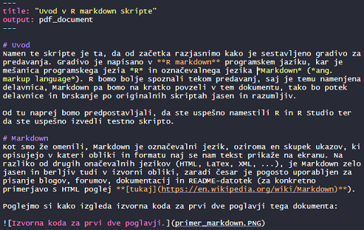
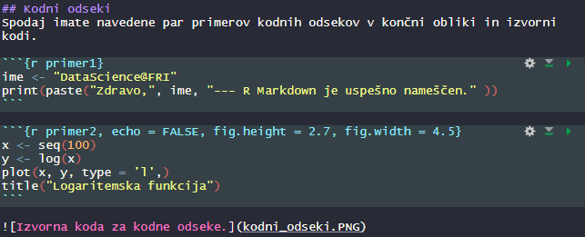

# Uvod
Namen te skripte je ta, da od začetka razjasnimo kako je sestavljeno gradivo za predavanja. Gradivo je napisano v **R Markdown** programskem jeziku, kar je mešanica programskega jezika *R* in označevalnega jezika *Markdown* (*ang. markup language*). R bomo bolje spoznali tekom predavanj, saj je temu namenjena delavnica, Markdown pa bomo na kratko povzeli v tem dokumentu, tako bo potek delavnice in brskanje po originalnih skriptah jasno in razumljivo.

Od tu naprej bomo predpostavljali, da ste na računalnik uspešno namestili R in R Studio ter da ste uspešno pognali testno skripto.

# Markdown
Kot smo že omenili, Markdown je označevalni jezik, oziroma en skupek ukazov, ki določajo v kateri obliki in formatu se bo tekst prikazal na ekranu. Na razliko od drugih označevalnih jezikov (HTML, LaTex, XML, ...), je Markdown zelo jasen in berljiv tudi v izvorni obliki, zaradi česar je pogosto uporabljen za pisanje blogov, forumov, dokumentacij in README-datotek (za konkretno primerjavo s HTML poglej **[tukaj](https://en.wikipedia.org/wiki/Markdown)**).

Poglejmo si kako izgleda izvorna koda za prvi dve poglavji tega dokumenta:



Kot opazimo, izvorna koda je navaden tekst, ki vsebuje le nekaj "posebnih" znakov, zaradi česar je zlahka berljiva. Če torej na kratko povzamemo, v Markdown-u lahko pišemo tekste na podoben preprost način kot v Word-u ali Notepade-u z izjemo, da z uporabo nekaterih znakov lahko direktno oblikujemo končen prikaz našega teksta.

# R Markdown

## Namestitev
R Markdown je ekstenzija Markdown-a, ki omogoča vstavljanje odsekov programske kode v Markdown tekst. Koda se avtomatkso požene vsakič ko prevedemo tekst v končni format (.pdf, .html ali .docx). Če hočemo to orodje uporabiti, ga moramo najprej namestiti med R-pakete: odpremo R Studio in vtipkamo v konzolo ukaz:

```{r eval = FALSE}
install.packages("rmarkdown")
```

Ukaz bo pognal inštalacijo vseh paketov, ki so potrebni za prevajanje R Markdown datotek. Ker bomo Markdown kodo prevajali v PDF datoteke, po končani namestitvi paketov izvedemo še ukaz:

```{r eval = F}
tinytex::install_tinytex()
```

Ko je inštalacija končala lahko testiramo, če smo uspešno namestili R Markdown. Trenutno PDF datoteko z navodili (`Uvod-v-R-markdown-skripte.pdf`) zapremo in preimenujmo v `Uvod-v-R-markdown-skripte-` `original.pdf`. Na tak način, v primeru da pride do kake napake, ne bo potrebno ponovno naložiti vseh navodil. Poleg tega, brez tega koraka bi R Markdown vrnil napako, ker mu ne bi uspelo nadomestiti prvotne datoteke, saj bi bila ta odprta v drugrem programu. V R Studio-u odpremo datoteko `Uvod-v-R-markdown-skripte.Rmd` in stisnemo gumb **Knit**, ki se nahaja na vrhu skripte, takoj pod zavihkom z imenom datoteke. Če se je vse izvedlo na pravilen način, se nam bi morala ponovno pojaviti datoteka `Uvod-v-R-markdown-skripte.pdf`.

## Kodni odseki
Spodaj je navedenih par primerov kodnih odsekov (*angl. "code chunks"*) v izvorni kodi (slika) in v končni obliki.



```{r primer1}
ime <- "DataScience@FRI"
print(paste("Zdravo,", ime, "--- R Markdown je uspešno nameščen." ))
```

```{r primer2, echo = FALSE, fig.height = 2.5, fig.width = 4.5}
x <- seq(100)
y <- log(x)
plot(x, y, type = 'l',)
title("Logaritemska funkcija")
```

Kodni odsek razmejujejo **3 zaporedni krativci** (znak: \` ). Dodatno, po prvem zaporedju krativcev, sta prisotna še vijugasta oklepaja, znotraj katerih so definirani *programski jezik*, *ime odseka* in *ostali parametri*. Da se odsek izvede, moramo definirati programski jezik, ime in ostali parametri pa niso nujni, saj lahko zavzamejo svoje prirejene vrednosti. Iz slike opazimo, da prvi kodni odsek uporablja programski jezik R in se imenuje "primer1". Drugi kodni odsek pa poleg programskega jezika in imena uporablja še parameter `echo = FALSE`, ki skrije vsebino kodnega izseka v končni datoteki, in parametra `fig.height` in `fig.width`, ki določata končno višino in širino slike.

Med pripravo R Markdown datoteke lahko sproti izvajamo vsak kodni odsek posebej. To lahko storimo s klikom na zeleni trikotni gumb na koncu prve vrstice odseka ali pa z bližnjico `Ctrl + Shift + Enter`, če se nahajamo s kurzerjem znotraj odseka.

## Drugi nasveti za boljše razumevanje delavnic

- Z R Markdown-om ne določamo delovnega direktorija, ker je že privzeto, da je ta na lokaciji skripte.

-  Znaka `< >`, ki v navodilih obdajata besede kot npr. "\<ime_dataframe-a\>", "\<ime in priimek\>", "\<datum\>" ipd. pomenita, da je potrebno na tisto mesto v skripti vnesti dejansko ime spremenljivke ali pa dejansko vrednost.

